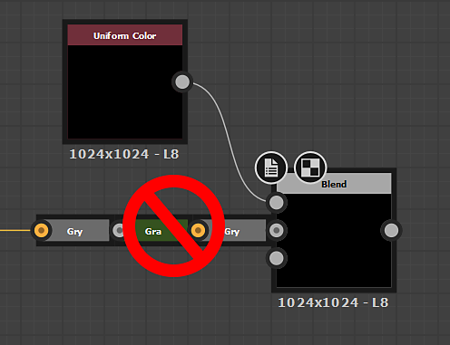

# 图表创建礼仪

创建大型复杂图形可能会快速变得混乱且难以导航。 有很多工具可以用来缓解这些问题，也有一些好的习惯可以介入，避免日后出现的问题。 本页提供了我们建议用于干净、高效、易于共享和理解的功能图形的完整技术列表。

## 常规

### 图表组织

#### 图形项目

图形项是可放置在[图形视图](../../interface/the-graph-view/the-graph-view.md)中节点旁边和周围的辅助对象。 在三种效果中，“框架”具有最快和最大的优势，而“注释”和“导航”PIN更适合特定场景。

#### 帧

让图表更清晰、更易于阅读的首要因素是在图表的核心组周围放置帧。 如果没有帧，大图表几乎无法读取，即使在绘制帧后，小图表也变得更容易理解。 帧的一个巨大优势是其<b>名称始终按相同的比例</b>渲染，即使您缩小非常远。

使用框架可以更轻松地了解图表中发生了什么。 他们可以在几个月后以作者身份重返工作岗位，或者像同事这样的其他用户找到办法浏览他们不习惯的Graph。

置入帧时，请使用以下标准：

* 标识&#x200B;**功能块**（例如，一起创建Dirt效果的8个节点）并使用帧将这些功能块分组。
* 始终尝试为帧&#x200B;**使用不同的颜色**：具有相同蓝色默认颜色的帧彼此之间不太突出。
* 使用不太长的&#x200B;**清晰的描述性名称**（有关更多提示，请参见下面的部分）
* 请不要将&#x200B;**过多或过少**&#x200B;放在一个框架中，因为这无助于提高可读性。 图形和功能之间的准确数量存在明显差异。
* 如有必要，**在说明中添加文本**&#x200B;以帮助了解框架中发生的情况。

#### 注释和图钉

注释和图钉仅次于帧，对于创作良好的图表来说，它们不是绝对必要的。 可在以下情况下使用它们：

* 注释适合在帧说明所允许的内容之外添加其他文本。 您可以在每个节点中添加少量的文本，主要用于提供一些细节信息。 评论的缩放效果不佳，而且无法从遥远的缩放级别进行阅读。
* 导航大头针允许您使用F2快捷键循环切换图形的特定区域。 这对于需要跳转进入两个相距甚远区域的超大图形非常有用。

### 输入和输出放置

输入和输出应放在图形的最末端：所有输出在右侧，所有输入在左侧，每个输入垂直对齐。 这样可以更容易地找到和识别它们。

上述示例是一个极端情况：帧并非始终必需或可能，但应该清楚的是，输入和输出的垂直对齐方式更清楚地显示了随机随机随机随机放置。

### 链接重路由

在大型、超长图形中，有时链接跨度非常大。 这会导致穿过该图形的链路布线混乱，且无需太多控制。 使用快捷键“Alt + Shift拖动”可以重新组织这些链接，通过细分链接并在中间添加一个额外的手柄来改变它们在另一条路径上的路径。 建议在可行的情况下使用它。

### 标签、标识符和用法

任何用于共享或发布的图形都应适当谨慎地添加到能够提升用户友好性的其他元数据中。 以下几点很重要：

默认建议的标签永远不够，需要花时间和精力将自定义标签添加到公开参数以及您的输入和输出。

尽量不让标识符和标签差异太大：如果标识符在其他地方使用（在多个函数中），则很难找到与哪个变量相关的UI属性。

尝试将您的标签与您在帧（帧标签）和注释中使用的术语匹配。 这样可以更轻松地找出图表的哪个部分与显示的参数有关

### 参数设置

在公开参数时，不仅要注意标签和标识符，还要注意以下几点：

* 选择正确的编辑器类型。 滑块可能并不总是有意义的：角度或下拉Ui元素也是可能性。
* 设置适当的“最小值”和“最大值”，并决定夹紧它们是否合理。
* 选择有意义的默认值：返回无用、边缘大小写结果的默认值应避免。
* 如果需要，可以考虑通过[函数](../../function-graphs/function-graphs.md)重新映射范围：从0.125到0.357的滑块没有任何意义，您可以轻松使用线性插值重新映射此范围，并让UI元素使用0到1的范围。

## Substance 图形

### 颜色和灰度管理

使用颜色和灰度数据时需要格外小心，因为这两种类型的混合操作很难实时执行。 应牢记以下几点：

* 图表不应包含点线红色（错误）链接。
* 彩色和灰度之间不应进行不必要的转换，反之亦然。 在某些情况下，“图形首选项”中的“自动插入颜色/灰度转换节点”会导致停靠的转换节点链过长、无用。
* 理想情况下，数据应尽可能长时间地保持灰度，并仅在绝对需要时进行转换。 这降低了复杂性并节省了性能。
* 应该针对正确的类型创建或设置输入和输出：例如，如果将“蒙版”输入转换为灰度以用作二进制蒙版，则将“蒙版”输入设置为彩色是没有意义的。

### 分辨率控制

控制[Substance图形](../../compositing-graphs/substance-compositing-graphs.md)的分辨率可能会混淆，因此需要正确执行此操作。 犯错可能会导致性能严重受损，或者导致质量低下、无法使用结果。

[要完全理解本主题，请确保您了解绝对和相对输出大小。](../../compositing-graphs/output-size/output-size.md)

* 几乎在所有情况下，应将图形设置为“相对于主页”分辨率，除非存在非常特定的例外情况，在这些情况中不需要该例外情况（非常罕见）。
* 节点通常不应具有输出大小的覆盖设置。 在大多数情况下，分辨率最好通过父级或图形属性来控制。
* 对于位图，应特别注意，默认的“绝对输出大小”不会在整个图形中扩散，而应覆盖它的“相对于主页”。 这是上述规则的少数例外之一。
