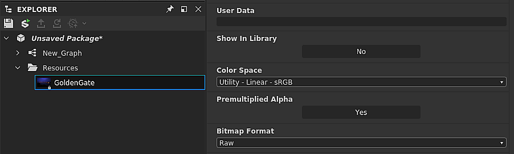

# 色彩管理

本页介绍Substance 3D Designer中的色彩管理功能和设置。

可以将Substance 3D Designer配置为使用[OpenColorIO](https://opencolorio.org/) (OCIO)或Adobe 颜色引擎(ACE)进行色彩管理。 这允许您在多个应用程序间拥有&#x200B;*一致的*&#x200B;色彩变换和图像显示。

在此模式下，Designer将在内部使用&#x200B;**线性RGB**&#x200B;颜色。 由于8位深度通常不足以表示线性颜色，因此建议对[图形](../compositing-graphs/substance-compositing-graphs.md)中的颜色纹理使用&#x200B;*至少* **16位**&#x200B;深度。

>[!WARNING]
>
> 有效的色彩管理工作流程依赖于使用正确的&#x200B;*已校准*&#x200B;显示器，因此存在第三方解决方案以使用专用硬件针对您的工作环境正确校准您的显示器。
> 
> OpenColorIO用户应为其显示器使用匹配的OpenColorIO色彩空间。\
> ACE用户应确保在OS *中选择的ICC配置文件*&#x200B;与&#x200B;*其*&#x200B;监视器匹配。

## 配置

可以在[首选项](../interface/preferences-window/preferences-window.md)对话框的[项目](../interface/preferences-window/project-settings/project-settings.md)选项卡中配置色彩管理设置。 您可以设置以下设置：

### 色彩管理模式

|  |  |
| --- | --- |
| <b>色彩管理</b> | 此设置允许您为Substance 3D Designer中的色彩管理选择[旧版](../color-management/color-management.md)、[OpenColorIO](#opencolorio)或[AdobeACE](#adobe-ace)模式。 *默认：旧版* |

## OpenColorIO

### OpenColorIO 配置

使用OpenColorIO模式进行色彩管理时，Designer将使用存储在<b>配置文件</b> (*\*.config*)中的信息进行色彩变换、识别色彩空间并设置默认值。

Substance 3D Designer附带以下配置：

* Substance：包含公共色彩空间的简单配置
* [ACES 1.0.3](https://github.com/hpd/OpenColorIO-Configs/tree/master/aces_1.0.3)：功能齐全的[Academy 颜色编码系统](https://www.oscars.org/science-technology/sci-tech-projects/aces) (ACES)配置，是色彩管理工作流程的行业标准

可在Designer安装文件的<b>资源> ocio</b>文件夹中找到这些配置文件。

|  |  |
| --- | --- |
| <b>OpenColorIO配置</b> | 此设置允许您选择在整个Designer中使用的OpenColorIO配置文件。 或者，可以使用OCIO环境变量设置OpenColorIO配置文件。  如果存在，配置文件将在Designer中&#x200B;*锁定*。 仍然可以更改默认色彩空间和显示变换（请参阅下面的设置）。  **警报：**&#x200B;添加环境变量后，我们建议关闭Designer，从操作系统中的用户会话&#x200B;*注销*，然后重新登录。 这可以确保环境变量在启动Designer时生效。 您还可以使用命令行创建临时环境变量，并从&#x200B;*相同*&#x200B;命令行环境中启动Designer。  *默认：Substance* |
| **自定义配置文件** | 如果&#x200B;**自定义**&#x200B;选项在&#x200B;**OpenColorIO配置**&#x200B;中设置，则可以选择&#x200B;*特定的\*.config文件&#x200B;*以在此字段中用作配置文件。*&#x200B;默认：由OpenColorIO配置文件或OCIO环境变量设置* |

### 位图色彩空间默认值

|  |  |
| --- | --- |
| <b>8位图像</b> | 设置8位位位图的默认色彩空间。 *默认：由OpenColorIO配置文件*&#x200B;设置 |
| <b>16位图像</b> | 设置16位位位图的默认色彩空间。 *默认：由OpenColorIO配置文件*&#x200B;设置 |
| <b>浮点图像</b> | 为浮点精度位图设置默认色彩空间，如&#x200B;*HDR*&#x200B;图像（采用&#x200B;*\*.exr *或*\*.hdr*格式）。 *默认：由OpenColorIO配置文件*&#x200B;设置 |
| <b>使用文件名检测色彩空间</b> | 如果位图文件名&#x200B;*的*&#x200B;后缀&#x200B;*与*&#x200B;当前OpenColorIO *配置*&#x200B;中包含的色彩空间的小写名称完全匹配，则允许Designer自动分配色彩空间。 示例：位图资源&#x200B;*mybitmap\_aces\_acescg.png*&#x200B;将自动设置为&#x200B;*ACE - ACEScg*&#x200B;色彩空间，并且适当的变换将应用于工作色彩空间。 *默认值：已选中* |

### 2D和3D视图显示默认设置

|  |  |
| --- | --- |
| <b>2D和3D视图显示默认值</b> | 为[2D视图](../interface/2d-view/2d-view.md)和[3D视图](../interface/3d-view/3d-view.md)视区设置默认&#x200B;*显示*&#x200B;色彩空间。 *默认：由OpenColor IO配置文件*&#x200B;设置 |
| <b>色彩管理缩览图</b> | 允许Designer将节点&#x200B;*缩略图*&#x200B;自动变换为图形中的&#x200B;*工作*&#x200B;色彩空间。 *默认值：已选中* |

## Adobe ACE

### 颜色设置

使用AdobeACE模式进行色彩管理时，Substance 3D Designer将使用<b>ICC配置文件</b> (*\*.icc / \*.icm*)中存储的信息执行色彩变换并识别色彩空间。

Designer随附多种ICC配置文件。 可在Designer安装文件的`resources > icc`文件夹中找到这些配置文件的文件。\
您可以添加&#x200B;*您自己的*&#x200B;个ICC配置文件，方法是将这些文件放在当前系统用户的&#x200B;*文档*&#x200B;文件夹中的`Adobe/Adobe Substance 3D Designer/icc`位置。

|  |  |
| --- | --- |
| <b>工作空间</b> | 此设置允许您选择工作色彩空间，以便在整个Substance 3D Designer中&#x200B;*执行色彩操作*。 *默认值： sRGB IEC61966-2.1* |
| <b>渲染方法</b> | 使用此选项，可以控制当颜色在&#x200B;*工作*&#x200B;色彩空间的&#x200B;*色域*&#x200B;之外时应如何变换颜色。 *默认值：相对比色* |

### 位图色彩空间默认值

|  |  |
| --- | --- |
| <b>8位图像</b> | 设置用于8位位位图的默认ICC配置文件。 *默认值：* sRGB IEC61966-2.1 ** |
| <b>16位图像</b> | 将默认ICC配置文件设置为使用16位位位图。 **默认值： *sRGB IEC61966-2.1*** |
| <b>浮点图像</b> | 设置用于浮点精度位图的默认ICC配置文件，如&#x200B;*\*.exr *或*\*.hdr*&#x200B;格式的*HDR*图像。 *默认：原始（即未应用配置文件）* |
| <b>可用时使用嵌入的ICC配置文件</b> | 允许Designer使用位图中嵌入的ICC配置文件，而不是使用上面列出的默认值。 *默认值：已选中* |

### 2D和3D视图显示默认空间

|  |  |
| --- | --- |
| <b>2D和3D视图显示默认值</b> | 为[2D视图](../interface/2d-view/2d-view.md)和[3D视图](../interface/3d-view/3d-view.md)视区设置默认&#x200B;*显示*&#x200B;色彩空间。 *默认：从OS中检索到主屏幕的&#x200B;*** ICC配置文件&#x200B;**&#x200B;** |

### 图形显示

|  |  |
| --- | --- |
| <b>色彩管理缩览图</b> | 在&#x200B;*选中*&#x200B;后，Designer会将&#x200B;*节点缩略图*&#x200B;转换为当前&#x200B;*工作色彩空间*。 *默认值：***&#x200B;未选中&#x200B;**&#x200B;** |

## 旧版模式

使用<b>旧版</b>模式时，色彩管理在Designer中&#x200B;*已禁用*-

在此模式下，图形和图像的行为与以前的版本完全相同。 这意味着如果此设置保持&#x200B;*不变*，则以前版本的工作流将&#x200B;*完全不受影响*。 不过，有一些有用的补充内容：

您可以选择使用<b>ACES sRGB</b> <b>3D视图</b>中的&#x200B;*色调映射*&#x200B;以匹配其他软件的输出，如&#x200B;*[Unreal Engine](https://docs.unrealengine.com/en-US/Engine/Rendering/PostProcessEffects/ColorGrading/index.html)*。

您可以为&#x200B;*导出的位图*&#x200B;设置色彩空间，如本页的[导出输出](#exporting-outputs)部分所述。 可用的色彩空间如下：

* sRGB
* 线性
* 原始

在旧版模式下，Designer使用<b>sRGB工作色彩空间</b>，大多数显示器都可以重现该空间。

考虑到“原始”选项会从图形写入图像数据&#x200B;*原样*（即使用图形工作色彩空间），这意味着<b>原始</b>和<b>sRGB</b>选项会生成&#x200B;*相同颜色输出*。

默认情况下，将为包含&#x200B;*色彩信息*（例如，Base color、Emissive）的输出设置“sRGB”选项，并为包含&#x200B;*纯数据*（例如，粗糙度、金属、Height、正常）的输出设置“原始”选项。 如上所述，这些默认设置有效地生成相同的颜色，并且仅设置为&#x200B;*区分其输出的最终用法*。

<b>线性</b>选项是&#x200B;*仅*&#x200B;选项，这会导致对图像应用&#x200B;*色彩变换*，并且只能用于<b>高动态范围</b> (HDR)图像，这些图像通常在线性色彩空间中使用&#x200B;*浮点精度*（即，16F或32F位深度）。 这使这些图像可以在各种色彩空间和生产环境中使用。

>[!NOTE]
>
> 有关图像导出的更多信息，请参阅文档的[导出位图](../compositing-graphs/exporting-bitmaps/exporting-bitmaps.md)页面。

## 导入位图

可以为导入和链接的位图分配<b>色彩空间</b> (OCIO)或<b>ICC配置文件</b> (AdobeACE)。

导入或链接位图时，将使用[项目设置](../interface/preferences-window/project-settings/project-settings.md)中<b>色彩管理</b>选项卡的<b>位图色彩空间默认</b>部分中设置的选项，在默认情况下&#x200B;*将色彩空间或ICC配置文件设置为位图资源。*

您可以随时更改位图的色彩空间，该选项位于位图资源的<b>属性</b>中。

>[!NOTE]
>
> **仅限OpenColorIO**
> 
> 特别是，**文件名**&#x200B;可用于自动设置适当的色彩空间&#x200B;**。 请注意，文件名中的色彩空间名称必须&#x200B;*与OpenColorIO配置文件中的名称*&#x200B;匹配（例如，*myImage\_utility - linear -srgb.png*&#x200B;将设置为&#x200B;*Utility - Linear - sRGB*&#x200B;色彩空间）。

## 导出输出

使用<b>导出输出</b>对话框时，可以为&#x200B;*每个*&#x200B;输出分配<b>色彩空间</b> (OCIO)或附加<b>ICC配置文件</b> (AdobeACE)。\
Designer将在保存图像文件之前&#x200B;*将*&#x200B;张图像转换为指定的色彩空间。

{width="512px"}

还可分配色彩空间(OCIO)或将ICC配置文件(AdobeACE)附加到从[2D 视图](../interface/2d-view/2d-view.md)保存的&#x200B;*图像*。

## 2D和3D视图

### 显示工具栏

您可以使用显示工具栏中的下拉菜单，随时&#x200B;*打开/关闭*&#x200B;色彩管理，并更改视图的&#x200B;*显示变换*。

{width="512px"}

### 库HDRI环境

Designer附带的HDRI环境位于<b>线性sRGB</b>色彩空间中。\
使用场景线性色彩空间为&#x200B;*非*&#x200B;线性sRGB的OpenColorIO配置（如[ACES](https://acescentral.com/t/getting-started-with-aces/1372)配置）时，环境将显示&#x200B;*不正确的颜色*。

在这种情况下，应在可在3D视图面板<b>环境</b>菜单中的环境属性中&#x200B;*手动*&#x200B;设置库HDRI环境的色彩空间。

{width="512px"}

## 颜色转换节点

[库](../interface/the-library/the-library.md)包括以下用于执行与ACEScg色彩空间之间的<b>转换</b>的节点：

<table>
<tr style="border: 0;">
<td style="border: 0;" valign="top">

[Substance 图形](../compositing-graphs/substance-compositing-graphs.md)

* ACEScg到线性sRGB
* 线性sRGB到ACEScg
* ACEScg到sRGB
* sRGB到ACEScg

</td>
<td style="border: 0;" valign="top">

[Substance 函数图形](../function-graphs/function-graphs.md)

* ACEScg到线性sRGB
* 线性sRGB到ACEScg

</td>
</tr>
</table>

在处理&#x200B;*创建的没有*&#x200B;色彩管理的图表或来自[Substance 3D资源](https://substance3d.adobe.com/assets)库的素材时，这些功能非常有用。

{width="512px"}

## 已知限制

当前在Substance 3D Designer中实施的色彩管理具有以下限制：

* 色彩管理当前在[Python API](../scripting/scripting.md)中&#x200B;*未*&#x200B;公开；
* [不支持OpenColorIO](https://opencolorio.org/) *外观* **。
