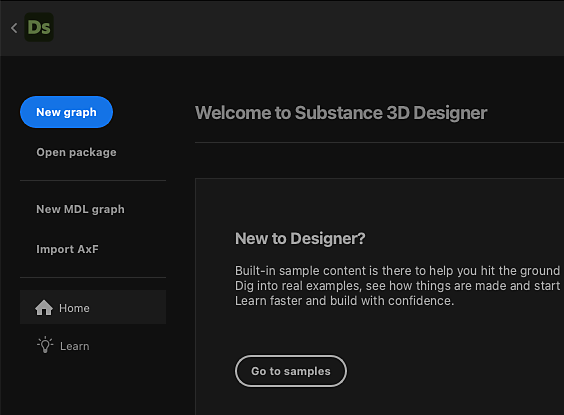
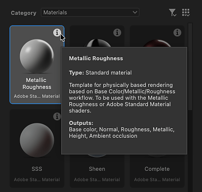
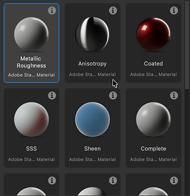
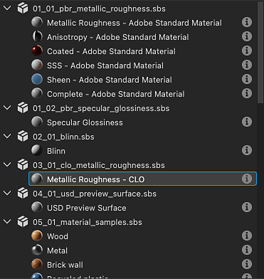
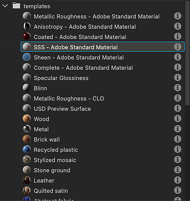

# 创建 Substance 图形

在Designer中创作纹理时，首先从预建模板或空图表创建Substance图表。

## 创建图表

若要开始创建新的[Substance图形](../../compositing-graphs/substance-compositing-graphs.md)的过程，可以使用以下方法之一：

* &#x200B;
  <table>
  <tr style="border: 0;">
  <td style="border: 0;" valign="top">

  在主屏幕中，单击<b>新建图形</b>按钮。

  </td>
  <td style="border: 0;" valign="top">

  {zoomable="yes"}

  </td>
  </tr>
  </table>

* &#x200B;
  <table>
  <tr style="border: 0;">
  <td style="border: 0;" valign="top">

  在[资源管理器](../../interface/the-explorer-window/the-explorer-window.md)中的任何&#x200B;*现有*&#x200B;包项上，单击<b>人民币</b>，然后在上下文菜单中转到<b>新建>Substance图形</b>。

  </td>
  <td style="border: 0;" valign="top">

  {zoomable="yes"}

  </td>
  </tr>
  </table>

* &#x200B;
  <table>
  <tr style="border: 0;">
  <td style="border: 0;" valign="top">

  在主工具栏中，单击 <b>新建Substance图形</b>按钮。

  </td>
  <td style="border: 0;" valign="top">

  {zoomable="yes"}

  </td>
  </tr>
  </table>

* &#x200B;
  <table>
  <tr style="border: 0;">
  <td style="border: 0;" valign="top">

  在主菜单中，转到<b>文件>新建>Substance图形……</b>

  </td>
  <td style="border: 0;" valign="top">

  

  </td>
  </tr>
  </table>

* 按<b>Ctrl+N</b> (Windows) / <b>Cmd+N</b> (macOS)按键。

无论您选择哪种方法，都将显示<b>新建Substance图表</b>对话框。

## 图表模板

无论使用哪种方法创建新Substance图形，您始终会看到<b>新Substance图形</b>对话框，您可以使用该对话框配置新图形。

{zoomable="yes"}

### 模板

Designer包含带有预配置节点的图表模板，可帮助您更快开始使用。 它们可能包括[输出](../../compositing-graphs/nodes-reference-for-com/atomic-nodes/output/output.md)节点、用于将值传递到这些输出的简单节点 — 例如，[统一颜色](../../compositing-graphs/nodes-reference-for-com/atomic-nodes/uniform-color/uniform-color.md)以及[输入](../../compositing-graphs/nodes-reference-for-com/atomic-nodes/input/input.md)节点。

双击列表中的模板，或选择模板并单击<b>创建</b>按钮，以使用该模板创建新的Substance图形。 默认情况下，新图形将被放置到新的未保存包中。

>[!TIP]
>
> 从头开始
> 
> 要从完全空白的图表开始，请在“空”类别中选择<b>空</b>模板。

>[!NOTE]
>
> 切换模板
> 
> 如果选择了错误的模板，则在创建图表后&#x200B;*无法*&#x200B;切换到其他模板。
> 
> 要将现有图形移植到其他模板，您可以使用适当的模板创建新图形，并将图形复制粘贴到新图形。 根据需要重新连接节点，特别是输出节点。

<table>
<tr style="border: 0;">
<td width="100.00%" style="border: 0;" valign="top">

每个模板均按其标签和副标题列出。

副标题提供了有关材质模型的&#x200B;*用例*&#x200B;的更多上下文：模板所基于的模板、要与之集成的软件等。

在<b>缩略图</b>模式下，副标题放在标签下方的较暗、较小的文本中。

在<b>列表</b>、<b>包</b>和<b>目录</b>查看模式中，副标题因此附加到标签中： *标签 — 副标题*。

</td>
<td width="25.00%" style="border: 0;" valign="top">

</td>
</tr>
</table>

### 素材示例

<b>材质示例</b>类别包括[精选图表](../../compositing-graphs/creating-compositing-gra/material-samples/material-samples.md)，供您学习并尝试。

您还可以使用<b>转到示例</b>按钮，直接从主屏幕访问示例。

所有样本均基于[材质模型](../../interface/3d-view/material-properties/material-properties.md#openpbr)。

{zoomable="yes"}

<table>
<tr style="border: 0;">
<td style="border: 0;" valign="top">

### 信息工具提示

将鼠标悬停在每个模板项目的“信息”图标上会显示工具提示，其中包含有关模板的其他信息：

<b>类型：</b>模板要生成的资源类型。 可在[图形属性](../../compositing-graphs/graph-parameters/graph-parameters.md)中编辑此项。

<b>描述：</b>有关模板的详细信息，例如模板集成到的工作流、其预期用例和使用建议。

<b>输出：</b>模板的[输出](../../compositing-graphs/nodes-reference-for-com/atomic-nodes/output/output.md)节点（如果有）。

</td>
<td style="border: 0;" valign="top">

{zoomable="yes"}

</td>
</tr>
</table>

<table>
<tr style="border: 0;">
<td width="100.00%" style="border: 0;" valign="top">

### 查看模式

使用<b>查看模式</b>按钮可按不同模式显示模板列表。

按所选类别和项目文件执行的筛选将应用于所有视图。

</td>
<td width="33.33%" style="border: 0;" valign="top">

{zoomable="yes"}

</td>
</tr>
</table>

+++查看模式
{zoomable="yes"}

<b>缩略图</b>

包含缩略图的卡片，提供了模板类型的预览或图标。

{zoomable="yes"}

<b>列表</b>

模板仅按其标签列出。

{zoomable="yes"}

<b>包</b>

模板按其标签列出为它们所属包文件的子级。

将鼠标悬停在包文件项上以显示工具提示及其完整路径。

{zoomable="yes"}

<b>目录</b>

模板按其标签列出为托管其所属包文件的目录的子级。

将鼠标悬停在目录项上以显示工具提示及其完整路径。

+++

### 属性

选择模板后，您可以设置有关新图形的基本信息。 在创建图形后，可以随时更改它。

<b>图形名称</b>：图形的标识符。 它对于给定的包需要是唯一的，并且不能包含空格和某些特殊字符。

<b>大小</b>：图形的主页分辨率，它将控制大多数节点的输出分辨率 — 请参阅[输出大小](../../compositing-graphs/output-size/output-size.md)页面以了解更多信息。 默认情况下，宽度和Height链接在一起，您可以通过单击宽度和Height组合框之间的链接按钮来取消它们的链接。

<b>在</b>中创建图形：您可以使用此组合框为新图形创建&#x200B;*新*&#x200B;包，或将新图形添加到任何&#x200B;*现有*&#x200B;包中，这些包已在[资源管理器](../../interface/the-explorer-window/the-explorer-window.md)面板中加载。

### 帮助工具提示

将鼠标悬停在问号图标上以显示工具提示，其中包含直接链接到此页面的按钮，因此您可以根据需要返回此文档。

{zoomable="yes"}

## 管理模板

<table>
<tr style="border: 0;">
<td width="100.00%" style="border: 0;" valign="top">

### 按类别过滤

类别用于按用例或资源类型对彼此相关的模板进行分组。

使用<b>类别</b>组合框选择要作为模板筛选依据的类别。

</td>
<td width="41.67%" style="border: 0;" valign="top">

{zoomable="yes"}

</td>
</tr>
</table>

<table>
<tr style="border: 0;">
<td width="100.00%" style="border: 0;" valign="top">

模板可以在其<b>模板数据</b>中设置类别 [图形属性](../../compositing-graphs/graph-parameters/graph-parameters.md)，用作筛选条件以缩小模板列表范围：

&lt;类别>；&lt;副标题>

可在项目文件提供的模板中设置自定义类别（请参阅下文）。 然后，这些类别将添加到组合框的列表中。

</td>
<td width="50.00%" style="border: 0;" valign="top">

{zoomable="yes"}

</td>
</tr>
</table>

<table>
<tr style="border: 0;">
<td width="100.00%" style="border: 0;" valign="top">

### 按项目文件筛选

如果任何活动的[项目文件](../../interface/preferences-window/project-settings/project-settings.md)提供一个或多个模板路径，则在这些路径中找到的包文件中的图形将添加到模板列表中。

然后，使用<b>按项目文件筛选</b>按钮将模板列表缩小到特定项目文件提供的模板列表。

</td>
<td width="33.33%" style="border: 0;" valign="top">

{zoomable="yes"}

</td>
</tr>
</table>
