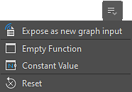

# 管理参数

当您需要以除直接调整参数之外的任何方式控制参数时，Designer提供了以下几种有用的操作：

* [复制并粘贴](#copy-paste-parameters)节点的所有参数的值
* 将节点的值或所有参数保存到[预设文件](../../compositing-graphs/manage-parameters/parameter-presets/parameter-presets.md)中，以便以后重复使用
* [公开节点的参数](../../compositing-graphs/manage-parameters/exposing-a-parameter/exposing-a-parameter.md)以使它们可访问并将它们链接在一起
* [根据其他参数的值隐藏或显示参数](../../compositing-graphs/visible-control-vis/visible-if-control-visibility-of-inputs-outputs-and-parameters.md)
* 使用[Substance函数图形](../../function-graphs/function-graphs.md)计算参数的值

## 参数操作

可用于管理参数的工具位于以下位置：

### 全局操作

<table>
<tr style="border: 0;">
<td width="100.00%" style="border: 0;" valign="top">

在“属性”停靠区中显示节点的属性时，可以使用以下节标题中的“<b>管理参数</b>”菜单全局管理节点参数：

* 对于[原子节点](../../compositing-graphs/nodes-reference-for-com/atomic-nodes/atomic-nodes.md)：特定参数
* 对于[实例节点](../../compositing-graphs/creating-compositing-gra/graph-instances-sub-gra/graph-instances-sub-graphs.md)：实例参数

</td>
<td width="33.33%" style="border: 0;" valign="top">

{zoomable="yes"}

</td>
</tr>
</table>

此菜单中的操作将影响该部分中列出的&#x200B;*所有*&#x200B;参数：

* <b>公开参数：</b>打开“批量公开参数”对话框。 对于每个公开参数，该动作将创建一个新的图形输入并使用该图形输入自动设置一个函数。 了解有关在[此专用页面](../../compositing-graphs/manage-parameters/exposing-a-parameter/exposing-a-parameter.md)中公开参数的更多信息。
* <b>复制参数：</b>请参阅下面的[复制和粘贴参数](#copy-paste-parameters)部分。
* <b>粘贴参数：</b>请参阅下面的[复制和粘贴参数](../../compositing-graphs/manage-parameters/manage-parameters.md)部分。
* <b>将参数另存为预设文件：</b>在[此专用页面](../../compositing-graphs/manage-parameters/parameter-presets/parameter-presets.md)中了解有关参数预设的更多信息。
* <b>应用预设文件中的参数：</b>了解有关[此专用页面](../../compositing-graphs/manage-parameters/parameter-presets/parameter-presets.md)中参数预设的更多信息。
* <b>全部重置：</b>将所有参数重置为默认值和范围。 如果函数应用于任何参数，则会将其关闭。

>[!NOTE]
>
> 某些操作不适用于某些原子节点。 请参阅下面的[原子节点限制](#atomic-nodes-limitations)。

### 单参数操作

<table>
<tr style="border: 0;">
<td width="100.00%" style="border: 0;" valign="top">

如果要管理&#x200B;*单个*&#x200B;参数，请使用与参数标签相对的“<b>管理函数</b>”菜单。

</td>
<td width="33.33%" style="border: 0;" valign="top">

{zoomable="yes"}

</td>
</tr>
</table>

可以通过三种方式将[Substance函数图形](../../function-graphs/the-function-graph/the-function-graph.md)应用于该参数：

* <b>公开为新图形输入：</b>这将创建一个新的图形输入并使用该图形输入自动设置函数。 详细了解公开[此专用页](../../compositing-graphs/manage-parameters/exposing-a-parameter/exposing-a-parameter.md)中的参数。
* <b>空函数：</b>从头开始创作函数。
* <b>常量值：</b>编辑从[常量值节点](../../function-graphs/nodes-reference-for-fun/atomic-function-nodes/constant-nodes/constant-nodes.md)开始并设置为参数当前值的函数。
* <b>重置：</b>将参数重置为其默认值和范围。 如果对参数应用了函数，则会将其关闭。

>[!NOTE]
>
> 复制/粘贴和预设文件操作对所有参数都是全局性的，因此不适用于单个参数。

### 节点上下文菜单

<table>
<tr style="border: 0;">
<td width="100.00%" style="border: 0;" valign="top">

上面列出的&#x200B;*全局*&#x200B;菜单中的某些参数操作在节点上下文菜单中可用。 单击节点上的RMB，然后转到“管理参数”以访问它们。

请注意，复制/粘贴操作在此菜单中不可用。 您可以在节点属性中找到它们，如上所述。

下面针对原子节点列出的相同限制适用于此菜单。

</td>
<td width="50.00%" style="border: 0;" valign="top">

{zoomable="yes"}

</td>
</tr>
</table>

<table>
<tr style="border: 0;">
<td style="border: 0;" valign="top">

## 复制和粘贴参数

可以复制源节点的所有参数值，然后将其粘贴到目标节点上。 源节点和目标节点的参数是<b>基于其标识符和类型</b>匹配的。

例如，如果“Scale”参数的标识符是“scale”并且类型是“Float”，则可以将其复制并粘贴到另一个参数“Shape Scale”上，只要其标识符也是“scale”并且类型也是“Float”即可。

此功能的工作方式与使用[参数预设文件](../../compositing-graphs/manage-parameters/parameter-presets/parameter-presets.md)的方式相同。 事实上，复制到剪贴板的数据与SBSPRS预设文件中存储的数据相同，并且可以粘贴到任何文本编辑器中以进行审阅和编辑。

</td>
<td style="border: 0;" valign="top">

{zoomable="yes"}

</td>
</tr>
</table>

## 原子节点限制

某些功能对于某些[原子节点](../../compositing-graphs/nodes-reference-for-com/atomic-nodes/atomic-nodes.md)不可用，因为它们具有特定的实现和控件。

这些操作……

* [复制/粘贴参数](#copy-paste-parameters)
* [保存/应用预设文件](../../compositing-graphs/manage-parameters/parameter-presets/parameter-presets.md)

...不适用于以下原子节点：

<table>
<tr style="border: 0;">
<td style="border: 0;" valign="top">

[位图](../../compositing-graphs/nodes-reference-for-com/atomic-nodes/bitmap/bitmap.md)

[曲线](../../compositing-graphs/nodes-reference-for-com/atomic-nodes/curve/curve.md)

[距离](../../compositing-graphs/nodes-reference-for-com/atomic-nodes/distance/distance.md)

[FX-Map](../../compositing-graphs/nodes-reference-for-com/atomic-nodes/fx-map/fx-map.md)

[渐变（动态）](../../compositing-graphs/nodes-reference-for-com/atomic-nodes/gradient-dynamic/gradient-dynamic.md)

</td>
<td style="border: 0;" valign="top">

[渐变映射](../../compositing-graphs/nodes-reference-for-com/atomic-nodes/gradient-map/gradient-map.md)

[输入彩色图像](../../compositing-graphs/nodes-reference-for-com/atomic-nodes/input/input.md)

[输入灰度图像](../../compositing-graphs/nodes-reference-for-com/atomic-nodes/input/input.md)

[输入值](../../compositing-graphs/nodes-reference-for-com/atomic-nodes/input/input.md)

[输出](../../compositing-graphs/nodes-reference-for-com/atomic-nodes/output/output.md)

</td>
<td style="border: 0;" valign="top">

[像素处理器](../../compositing-graphs/nodes-reference-for-com/atomic-nodes/pixel-processor/pixel-processor.md)

[SVG](../../compositing-graphs/nodes-reference-for-com/atomic-nodes/svg/svg.md)

[文本](../../compositing-graphs/nodes-reference-for-com/atomic-nodes/text/text.md)

[统一颜色](../../compositing-graphs/nodes-reference-for-com/atomic-nodes/uniform-color/uniform-color.md)

[值处理器](../../compositing-graphs/nodes-reference-for-com/atomic-nodes/value-processor/value-processor.md)

</td>
<td style="border: 0;" valign="top">

</td>
</tr>
</table>
