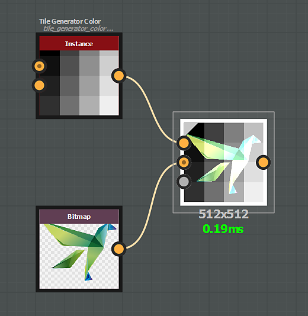
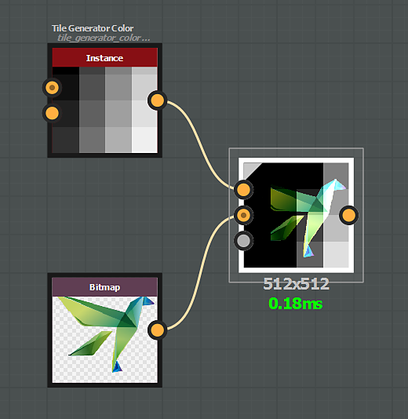
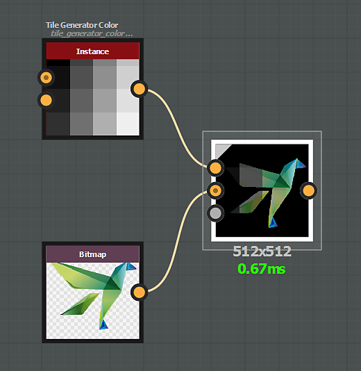

# 混合模式

[混合](../../../../../compositing-graphs/nodes-reference-for-com/atomic-nodes/blend/blend.md)节点提供以下混合模式：

## 复制

*复制*&#x200B;混合模式会将前景置于背景之上。

{zoomable="yes"}

对于彩色图像，不透明度中默认考虑Alpha通道。

可使用“Alpha混合”参数更改此设置。

"){zoomable="yes"}

## 添加（线性减淡）

*添加*&#x200B;混合模式会将前景输入值添加到背景中的每个相应像素。

{zoomable="yes"}

## 减去

*减去*&#x200B;混合模式将从背景中的每个相应像素中减去前景输入值。

如果减去的结果低于0，该值将被限制为0，从而产生纯黑色。

{zoomable="yes"}

## 正片叠底

*正片叠底*&#x200B;混合模式会将背景输入值乘以前景中每个相应的像素。

由于每个像素的值包含在0和1之间，因此结果始终等于或小于原始值（较暗）。

{zoomable="yes"}

## 添加子项

*添加子集*&#x200B;混合模式的工作方式如下：

* 值大于0.5的前景像素将添加到其各自的背景像素中。
* 值小于0.5的前景像素从各自的背景像素中减去。

{zoomable="yes"}

## 最大值（变亮）

*Max*&#x200B;混合模式将在背景和前景之间选取较高的值。

{zoomable="yes"}

## 最小值（变暗）

*最小*&#x200B;混合模式将在背景和前景之间选取较低的值。

{zoomable="yes"}

## 切换

*切换*&#x200B;混合模式与复制模式类似，但有一个&#x200B;*关键*&#x200B;差异：

* “不透明度”设置为0：将不计算连接到“前景”输入&#x200B;*的节点流*。
* “不透明度”设置为1：将不计算连接到“背景”输入&#x200B;*的节点流*。

因此，此模式可用于改进图表的性能。

[开关](../../../../../compositing-graphs/nodes-reference-for-com/node-library/filters/blending/switch/switch.md)和[开关灰度](../../../../../compositing-graphs/nodes-reference-for-com/node-library/filters/blending/switch/switch.md)节点设置为在这些特定配置中使用混合节点。

{zoomable="yes"}

## 划分

*分割*&#x200B;混合模式会将背景输入像素值除以前景中每个相应的像素。

{zoomable="yes"}

## 叠加

*叠加*&#x200B;混合模式结合了“正片叠底”和“滤色”混合模式：

* &#x200B;
  * 如果较低图层像素的值低于0.5，则应用&#x200B;*正片叠底*&#x200B;类型混合
  * 如果较低图层像素的值高于0.5，则应用&#x200B;*滤色*&#x200B;类型混合

{zoomable="yes"}

## 滤色

使用滤色混合模式，两个输入中的像素值将反相、相乘，然后再次反相。

结果对于正片叠底效果恰好相反，与原始图像相比总是等于或更高（更亮）。

{zoomable="yes"}

## 柔光

“柔光”混合模式可根据前景颜色的亮度，创建细微的亮色或暗色效果。

混合亮度超过50%的颜色会使背景像素变亮，而亮度低于50%的颜色会使背景像素变暗。

{zoomable="yes"}
