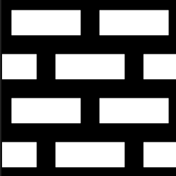

# 距离

<table>
<tr style="border: 0;">
<td width="20%" style="border: 0;" valign="top">

</td>
<td style="border: 0;" valign="top">

查找蒙版中最近白色像素的位置，并从该位置输出渐变，或者输出源图像中该位置的颜色。

此节点从输入最大值超过0.5灰度值的任何像素创建向外线性渐隐（渐变）。

</td>
</tr>
</table>

不断扩大的向外淡化将在遇到另一个单元时终止：它们永远不会重叠。 在内部，这会实际计算和显示到最接近像素> 0.5的距离，并将距离节点设置为固定/最大值。

可选的源映射允许将单元格与辅助输入映射中的纹理相结合。

距离节点并不是一个容易掌握的节点，但主要使用情形是以可靠的方式扩展现有蒙版（与模糊和调整对比度相比），生成Voronoi类型的噪声单元，以及使现有形状具有尖锐的线性轮廓（以后可以重新映射）。

有关详细信息，请参阅以下[示例](#examples)。

## 参数

|  |  |
| --- | --- |
| <b>颜色模式</b> *布尔值* | 在灰度图像和彩色输出图像之间切换。 同时更改“源输入”输入类型。 |
| <b>最大距离</b> *浮动* | 调整最大距离以检测蒙版中最接近的边框，以像素为单位。 |
| <b>合并源/距离</b> *布尔值* | 确定可选的“源输入”与最终单元格的组合方式。<ul data-preserve-html="true"> <li data-preserve-html="true"><i>合并：</i>将“源输入”值与渐隐线性蒙版合并。 如果连接了“源输入”输入，则其值与计算的距离相结合。</li> <li data-preserve-html="true"><i>仅源：</i>仅从“源输入”生成纯色。</li> </ul> |
| <b>距离模式</b> *整数* | 选择计算所提取蒙版中到最接近边框的距离的方法：<ul data-preserve-html="true"> <li data-preserve-html="true"><i>欧几里德：</i>平方X/Y差的总和。</li> <li data-preserve-html="true"><i>曼哈顿：</i> X/Y差值的绝对值总和。</li> <li data-preserve-html="true"><i>Chebyshev：</i> X/Y差异的绝对值的最大值。</li> </ul>  

 |

## 输入连接器

|  |  |
| --- | --- |
| <b>蒙版输入</b> *灰度*&#x200B;主要 | 灰度蒙版，应计算其距离值的边界。   使用阈值0.5从图像中提取二进制蒙版，其中高于该阈值的所有值都是白色，而低于该阈值的所有值都是黑色。 |
| <b>源输入</b> *彩色/灰度* | 可选的灰度图像，应从中复制“蒙版输入”最近边框的像素值。 |

## 示例

<table>
<tr style="border: 0;">
<td style="border: 0;" valign="top">

</td>
<td style="border: 0;" valign="top">

</td>
<td style="border: 0;" valign="top">

</td>
</tr>
</table>
