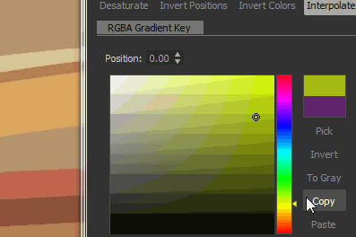

# 渐变映射

<table>
<tr style="border: 0;">
<td width="33.33%" style="border: 0;" valign="top">

{width="20%"}

</td>
<td width="100.00%" style="border: 0;" valign="top">

使用自定义渐变重新映射图像中的灰度值。

此节点具有双重用途：它可以简单地用作<b> </b>灰度到颜色转换节点，或要着色灰度输入，请将其映射到自定颜色渐变。

</td>
</tr>
</table>

该节点提供了一个高级且功能丰富的渐变编辑器，可精确映射多个颜色：请转到本页的[渐变编辑器](#gradient-editor)部分以了解更多信息。

|  |  |
| --- | --- |
| <b>颜色模式</b> *布尔值* | 将输出模式设置为“彩色”或“灰度”。 |
| <b>渐变寻址</b> *布尔值* | 将渐变设置为重复（拼贴）或固定超出[0， 1]范围的值。 |
| <b>渐变</b> *渐变键数组* | 用于映射输入灰度值的自定义渐变渐变。   可以在原地编辑或使用[渐变编辑器](#gradient-editor)进行编辑。 |

## 渐变编辑器

此窗口提供控件，可用于编辑渐变映射节点用于将灰度值映射到颜色的参考渐变。

可以通过以下方式从渐变映射节点的<b>属性</b>中打开它：

* 单击<b>渐变编辑器</b>按钮上的LMB；
* 双击渐变栏中某个图钉上的LMB 。 然后，将在“渐变编辑器”中自动选择单击的图钉，以便您可以直接编辑其值。

{width="20%"}

### 编辑渐变图钉

颜色及其沿渐变的位置由渐变条上放置的图钉控制。

每个大头针都会在其渐变上的位置设置一种颜色。

第一个颜色和最后一个颜色之前和之后的渐变部分分别设置为这些大头针的大头针。

以下控件可用于编辑大头针：

<table>
<tr style="border: 0;">
<td style="border: 0;" valign="top">

<b>添加大头针</b>

单击渐变上或渐变下方的LMB，以在渐变条中单击的位置添加大头针。

新大头针将被设置为该位置的渐变颜色。

</td>
<td style="border: 0;" valign="top">

</td>
</tr>
</table>

<table>
<tr style="border: 0;">
<td style="border: 0;" valign="top">

<b>移动大头针</b>

按住LMB并沿渐变条拖动选定大头针以移动它们。

也可以通过选择大头针的位置并使用<b>位置</b>参数来设置具有数值的路径的位置。 位置是[0；1]范围内的值，其中0是渐变的开始，1是渐变的结束。

</td>
<td style="border: 0;" valign="top">

</td>
</tr>
</table>

选择多个大头针后，它们可以&#x200B;*同时*&#x200B;移动。 当一个或多个大头针在移动时到达渐变的末端时，根据用于移动的鼠标按钮，有两种行为可用：

* <b>LMB：</b>大头针保留在末端，这意味着当它们到达该位置并且其相对位置改变时，它们将被栈叠在该位置；
* <b>MMB：</b>大头针环回渐变的另一端，这意味着它们的相对位置保持不变。

<table>
<tr style="border: 0;">
<td style="border: 0;" valign="top">

<b>删除大头针</b>

选择大头针并按Delete键，或者将大头针拖离渐变条以删除它们。

</td>
<td style="border: 0;" valign="top">

</td>
</tr>
</table>

<table>
<tr style="border: 0;">
<td style="border: 0;" valign="top">

<b>反转位置</b>

镜像渐变上选定大头针的位置。

</td>
<td style="border: 0;" valign="top">

</td>
</tr>
</table>

<table>
<tr style="border: 0;">
<td style="border: 0;" valign="top">

<b>全部清除</b>

从渐变条中删除所有图钉。

</td>
<td style="border: 0;" valign="top">

</td>
</tr>
</table>

<b>反转颜色</b>

此按钮可将选定针脚的颜色切换为负色。

<b>降低饱和度</b>

此按钮降低所选图钉上设置的颜色的饱和度。

### 插值模式

设置图钉后，可使用可用的插值模式控制颜色从一个图钉过渡到下一个图钉的方式：

+++线性
默认插值模式：在每个图钉之间应用简单的线性插值，以便渐变均匀进行。

+++

+++平面切线
将渐变之间的过渡视为贝塞尔曲线时（曲线上的点为图钉），此模式会将这些点设置为具有水平切线。

这将产生一个过渡，它唤起了对平滑步长插值的回忆。

选择此模式时，将启用<b>中点</b>参数，并允许您偏移曲线垂直中点在点之间的水平位置。 这有效地调整了“out”和“in”切线之间的比例。

+++

+++平滑
将平滑应用于每个点之间的插值曲线。

选择此模式时，将启用<b>Smoothness</b>参数，并允许您在值0等于<b>线性</b>插值模式的情况下调整平滑的强度。

+++

+++无插值
颜色仅在图钉位置发生变化，并在渐变条上的下一个图钉之前保持不变。

这会导致颜色之间出现硬步骤，并且仅渐变上存在由图钉设置的颜色。

+++

### 拾色器

拾色器允许您通过多种方式设置颜色：

* <b>渐变和色相栏</b>

  <table>
  <tr style="border: 0;">
  <td style="border: 0;" valign="top">

  微调小工具在渐变中的位置以及色相条中陷波的位置，以设置颜色。

  </td>
  <td style="border: 0;" valign="top">

  

  </td>
  </tr>
  </table>

* <b>RGB、HSV和Alpha滑块</b>

  <table>
  <tr style="border: 0;">
  <td width="100.00%" style="border: 0;" valign="top">

  使用RGB、HSV和Alpha滑块，可以通过微调滑块或直接设置其数值来精确地设置颜色。

  或者，在滑块下方的专用输入字段中使用十六进制代码。

  </td>
  <td width="33.33%" style="border: 0;" valign="top">

  

  </td>
  </tr>
  </table>

* <b>在屏幕上选取</b>

  <table>
  <tr style="border: 0;">
  <td style="border: 0;" valign="top">

  使用“<b>选取</b>”按钮，然后在屏幕的任意位置单击LMB以对该位置的颜色进行取样。

  </td>
  <td style="border: 0;" valign="top">

  

  </td>
  </tr>
  </table>

<table>
<tr style="border: 0;">
<td width="100.00%" style="border: 0;" valign="top">

选定颜色会在颜色缩览图的上半部分预览。\
下半部分显示以前使用的颜色。 双击它上的LMB，将调整后的颜色恢复为它。

</td>
<td width="16.67%" style="border: 0;" valign="top">

</td>
</tr>
</table>

当选择多个图钉时，RGB、HSV和Alpha滑块将变成Δ(Δ)滑块，这意味着它们用于以相同的量偏移每个图钉的值。

<table>
<tr style="border: 0;">
<td width="100.00%" style="border: 0;" valign="top">

此外，颜色缩略图下方还提供以下功能作为按钮：

<b>反转：</b>将颜色切换为负片；

<b>变灰：</b>降低颜色的饱和度；

<b>复制&#x200B;</b>*：*&#x200B;将当前选定的颜色复制到剪贴板；

<b>粘贴：</b>切换到剪贴板中的当前颜色；

<b>sRGB</b>：使用sRGB色彩空间显示颜色。 禁用时，使用线性色彩空间；

<b>浮点：</b>在浮点中显示RGB、HSV和Alpha滑块值。

</td>
<td width="25.00%" style="border: 0;" valign="top">

</td>
</tr>
</table>

### 渐变滴管

“渐变”吸管是此节点提供的最有用的功能之一，因为只需在参考图片上绘制一条线即可创建复杂的渐变。

<b>精度</b>滑块将通过增加或减少键数帮助您调整新创建的渐变：键值越小，渐变与所选值的匹配越精确。

## 输入连接器

|  |  |
| --- | --- |
| <b>输入</b> *灰度*&#x200B;主要 | 要处理的灰度图像。 |

## 示例

*即将推出。*
