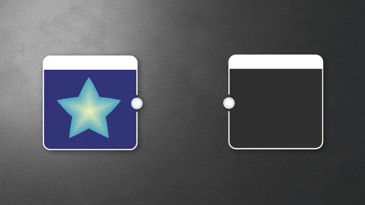

# HSL

<table>
<tr style="border: 0;">
<td style="border: 0; width:33.33%; vertical-align:top">

{width="100%"}

<b>在：</b>个原子节点中

</td>
<td style="border: 0;" valign="top">

调整彩色图像的色相、饱和度和明亮度。

它是基本、易于使用的节点，在处理颜色数据时非常有用。

如果您想用其他方法来编辑图像的色调，请查看[曲线](../../../../compositing-graphs/nodes-reference-for-com/atomic-nodes/curve/curve.md)、[色阶](../../../../compositing-graphs/nodes-reference-for-com/atomic-nodes/levels/levels.md)和[对比度/明度](../../../../compositing-graphs/nodes-reference-for-com/node-library/filters/adjustments/contrast-luminosity/contrast-luminosity.md)。

</td>
</tr>
</table>

<table>
<tr style="border: 0">
<td style="border: 0; width: 15%"></td>
<td style="border: 0; text-align: center"></td>
<td style="border: 0; width: 15%"></td>
</tr>
</table>

## 参数

|  |  |
| --- | --- |
| <b>色相</b> *浮动* | 确定输入图像的颜色。   低于0.5的值对色相的影响是负的，高于0.5的值对色相的影响是正的。 |
| <b>饱和度</b> *浮动* | 确定输入图像颜色的饱和度。   低于0.5的值会降低饱和度，高于0.5的值会增加饱和度。 |
| <b>亮度</b> *浮动* | 确定低于0.5的输入图像的亮度值会使亮度降低，高于0.5的值会使亮度升高。 |

## 输入连接器

|  |  |
| --- | --- |
| <b>输入</b> *颜色*&#x200B;主要 | 要处理的图像。 |

## 示例

*即将推出。*
