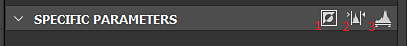

# 色阶

<table>
<tr style="border: 0;">
<td width="33.33%" style="border: 0;" valign="top">

{width="200px"}

</td>
<td width="100.00%" style="border: 0;" valign="top">

调整图像阴影、中间色调和高光的全局色调范围和色彩平衡。

“色阶”节点允许您通过设置输入和输出重新映射因子来重新映射输入的色调，该因子显示在其他2D图像编辑器熟悉的直方图界面中。

</td>
</tr>
</table>

它是Substance 3D Designer中最核心且最有用的节点之一，通常用于重新映射和调整图形中的值，因为它为更改值提供了最精确和准确的界面。

尽管它是一个重要节点，但对于某些用例而言，界面可能会有点繁琐，因此请确保查看[自动色阶](../../../../compositing-graphs/nodes-reference-for-com/node-library/filters/adjustments/auto-levels/auto-levels.md)、[对比度/明度](../../../../compositing-graphs/nodes-reference-for-com/node-library/filters/adjustments/contrast-luminosity/contrast-luminosity.md)和[直方图扫描](../../../../compositing-graphs/nodes-reference-for-com/node-library/filters/adjustments/histogram-scan/histogram-scan.md)以获取替代项。

<table>
<tr style="border: 0;">
<td width="100.00%" style="border: 0;" valign="top">

</td>
<td width="83.33%" style="border: 0;" valign="top">

</td>
<td width="100.00%" style="border: 0;" valign="top">

</td>
</tr>
</table>

## 示例

## 参数

节点提供两个界面来调整其值：直方图界面和滑块界面。 您可以使用“特定参数”标题栏中最右侧的按钮在它们之间切换：

<table>
<tr style="border: 0;">
<td width="100.00%" style="border: 0;" valign="top">

突出显示的黄色按钮用于切换直方图（顶部）值滑块（底部）之间的界面

</td>
<td width="66.67%" style="border: 0;" valign="top">

</td>
</tr>
</table>

|  |  |
| --- | --- |
| <b>输入低光色阶</b> *Float/Float4* | 定义输入图像的低光级别。 重新映射输入的Low值，使其变为全黑色。 |
| <b>输入高光色阶</b> *Float/Float4* | 定义输入图像的高光级别。  将输入的High值重新映射为全白色。 |
| <b>输入中间色阶</b> *Float/Float4* | 定义输入图像的中间色调级别。  将输入Mid值重新映射为中间灰色。 |
| <b>水平输出低</b> *Float/Float4* | 定义输出图像的低光级别。  钳制输出Black值以设置限制。 |
| <b>输出高光色阶</b> *浮动/浮动4* | 定义输出图像的高光级别。  钳制输出白色值以设置限制。 |
| <b>中间夹具</b> *布尔值* | 在计算输出电平之前，确定转换的输入值是否被固定到[0， 1]。 |

## 使用指南

请观看有关“色阶”节点及其直方图编辑器的视频概述：

### 快速操作

在“特定参数”标题栏中，您可以找到一些按钮，以访问直方图的便捷功能：

<b>1 — 反转：</b>交换“Level out low”和“Level out high”参数的值。

<b>2 — 自动色阶：</b>将“低中的色阶”和“高中的色阶”参数的值分别自动调整为图像中存在的最低和最高值。

<b>3 — 切换界面：</b>在直方图编辑器和滑块编辑器之间切换。

### 直方图

直方图编辑器旨在进行可视、快速调整，其中并不真正需要精确值，并且曝光参数无关紧要。 通常，这是使用色阶的最为快捷简便的方式。

根据输入类型（“颜色”或“灰度”），您可以使用“直方图”上方的下拉菜单选择要修改的通道。

### 滑块

滑块编辑器不使用任何可视编辑器，仅提供数字滑块，主要在要固定或重新映射到非常精确的值时有用，或者如果打算[公开这些参数中的任何一个](../../../../compositing-graphs/manage-parameters/exposing-a-parameter/exposing-a-parameter.md)，因为仅在滑块编辑器中才可能提供。

滑块的变化取决于颜色或灰度输入：颜色输入为每个RGBA通道单独创建4个滑块，灰度只有一个滑块，使得操作更轻松。 有关每个滑块的说明，请参阅上面的“参数”列表。

## 输入连接器

|  |  |
| --- | --- |
| <b>输入</b> *灰度/颜色*&#x200B;主要 | 要处理的图像。 |

## 输出连接器

|  |  |
| --- | --- |
| <b>输出</b> *灰度/颜色* |  |

## 示例

*即将推出。*
