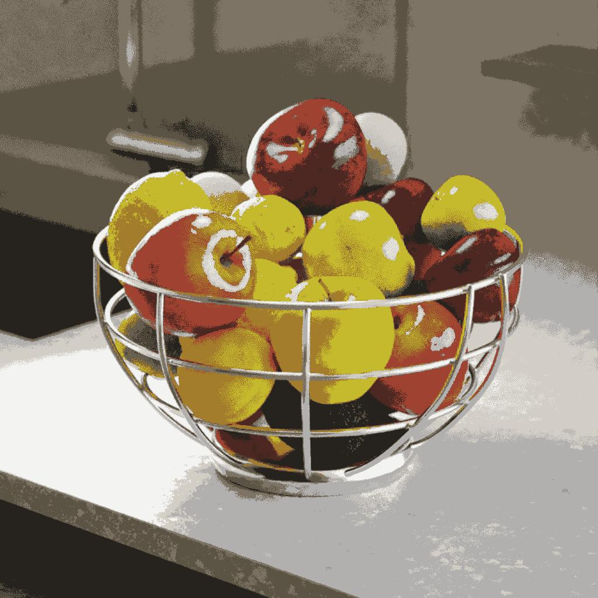

# 应用调色板

<table>
<tr style="border: 0;">
<td width="33.33%" style="border: 0;" valign="top">

{width="200px"}

<b>英寸：</b>滤镜>调整

</td>
<td width="100.00%" style="border: 0;" valign="top">

## 描述

使用ID映射将有序调色板中的颜色应用于图像。

通过将ID映射中的索引与调色板中的颜色索引进行匹配来分布颜色。

例如，调色板中的颜色#2将应用于ID映射中ID值为2的所有像素。

此节点可以与以下节点结合使用： [量化颜色](../../../../../../compositing-graphs/nodes-reference-for-com/node-library/filters/adjustments/quantize-color/quantize-color.md)、[创建调色板](../../../../../../compositing-graphs/nodes-reference-for-com/node-library/filters/adjustments/create-color-palette-16/create-color-palette-16.md)、[修改调色板](../../../../../../compositing-graphs/nodes-reference-for-com/node-library/filters/adjustments/modify-color-palette/modify-color-palette.md)、[查看调色板](../../../../../../compositing-graphs/nodes-reference-for-com/node-library/filters/adjustments/view-color-palette/view-color-palette.md)。

</td>
</tr>
</table>

<table>
<tr style="border: 0;">
<td style="border: 0;" valign="top">

</td>
<td style="border: 0;" valign="top">

### 输出连接器

</td>
<td style="border: 0;" valign="top">

</td>
</tr>
</table>

## 输入连接器

|  |  |
| --- | --- |
| <b>ID</b> *灰度*&#x200B;主要 | 用于在输入调色板中分布颜色的输入ID映射。   ID图是整体像素（如形状）全部包含相同唯一标识值的图像。 在本例中，该值是一个整数。   可以使用[Quantize Color](../../../../../../compositing-graphs/nodes-reference-for-com/node-library/filters/adjustments/quantize-color/quantize-color.md)节点生成ID映射。 |
| <b>调色板</b> *颜色* | 以像素行编码的RGB的有序列表。 调色板最多可包含256种颜色。 这是节点映射到ID映射索引的调板。   可以使用[量化颜色](../../../../../../compositing-graphs/nodes-reference-for-com/node-library/filters/adjustments/quantize-color/quantize-color.md)节点生成调色板，并使用[修改调色板](../../../../../../compositing-graphs/nodes-reference-for-com/node-library/filters/adjustments/modify-color-palette/modify-color-palette.md)节点修改调色板。 |

## 输出连接器

|  |  |
| --- | --- |
| <b>输出</b> *颜色* | 将调色板中的颜色映射到ID映射的索引的结果。 |

## 示例

{zoomable="yes"}

<table>
  <tr>
    <td>
      
       <i>之前</i>
    </td>
    <td>
      
       <i>之后</i>
    </td>
  </tr>
</table>

{zoomable="yes"}

<table>
  <tr>
    <td>
      
       <i>之前</i>
    </td>
    <td>
      
       <i>之后</i>
    </td>
  </tr>
</table>
