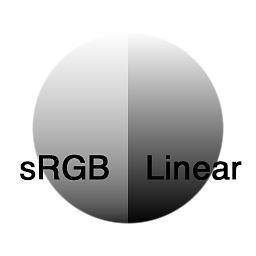

# 转换为线性

<table>
<tr style="border: 0;">
<td width="33.33%" style="border: 0;" valign="top">

{width="128px"}

{width="128px"}

<b>英寸：</b>滤镜>调整

</td>
<td width="100.00%" style="border: 0;" valign="top">

## 描述

将sRGB色彩空间图像转换为线性图像。 例如，在转换照片源素材时有用。

</td>
</tr>
</table>
