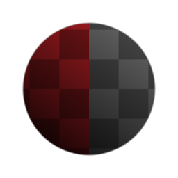

# 高级灰度转换

<table>
<tr style="border: 0;">
<td style="border: 0;" valign="top">

{width="128px"}

## 高级灰度转换

**范围：** *滤镜/调整*

**简单**

</td>
<td style="border: 0;" valign="top">

## 描述

高级、快速灰度转换节点，提供了一些预设转换模式。

## 参数

* **灰度类型**：*去除饱和度、亮度、平均值、最大值、最小值*&#x200B;去除饱和度将饱和度值设置为0，亮度使用正式的明亮度粗细，平均值与原子节点相同，而“最大值”和“最小值”将分别为每个通道使用最亮值。

## 示例图像

| 

 |
| --- |
|  |

</td>
</tr>
</table>
