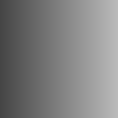

# 直方图范围

<table>
<tr style="border: 0;">
<td width="33.33%" style="border: 0;" valign="top">

{width="128px"}

<b>英寸：</b>滤镜>调整

</td>
<td width="100.00%" style="border: 0;" valign="top">

## 描述

缩小和/或移动灰度输入的范围。 可用于重新映射过渡（类似于[对比度明度](../../../../../../compositing-graphs/nodes-reference-for-com/node-library/filters/adjustments/contrast-luminosity/contrast-luminosity.md)），但具有不同的控件，这在某些情况下可能更有意义。\
另请参阅[直方图扫描](../../../../../../compositing-graphs/nodes-reference-for-com/node-library/filters/adjustments/histogram-scan/histogram-scan.md)，了解另一种更有用的重新映射范围的方法。

[单击此处观看关于直方图范围的Substance学院视频。](https://www.youtube.com/watch?v=p9wcmJBFyGA&t=517s)

</td>
</tr>
</table>

## 参数

|  |  |
|:---|:---|
| <b>范围</b> <i>0.0 - 1.0</i> | 将范围减小到什么程度。 这类似于向内移动“最小色阶”和“最大色阶”滑块。 |
| <b>位置</b> <i>0.0 - 1.0</i> | 范围减小的偏移，为范围减小设置不同的中点。 |

## 示例

<table style="margin-top: 32px; margin-bottom: 32px">
    <tr style="border: 0">
        <td style="border: 0; background: transparent">
            
        </td>
    </tr>
</table>
