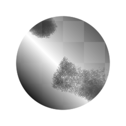

# 直方图扫描不均匀

<table>
<tr style="border: 0;">
<td style="border: 0;" valign="top">

{width="128px"}

## 直方图扫描不均匀

**范围：** *滤镜/调整*

**复杂**

</td>
<td style="border: 0;" valign="top">

## 描述

[直方图扫描](../../../../../../compositing-graphs/nodes-reference-for-com/node-library/filters/adjustments/histogram-scan/histogram-scan.md)的高级版本，带有额外的控件和输入，可在每像素级别上驱动效果，而不是在整个图像中统一。 可用于实现更复杂的蒙版中的对比度和过渡。

使用它比常规[直方图扫描](../../../../../../compositing-graphs/nodes-reference-for-com/node-library/filters/adjustments/histogram-scan/histogram-scan.md)复杂得多，因此，在尝试使用非统一版本之前，请确保您熟悉它。

## 参数

### 输入

* **输入**： *灰度输入*&#x200B;要修改的源结果。
* **位置映射**： *灰度输入*&#x200B;用于驱动位置参数的输入插槽。 在“使用位置输入”设置为True时激活。 有效值范围较小，具体取决于对比度映射和设置。
* **对比度映射**： *灰度输入*&#x200B;用于驱动对比度参数的输入插槽。 在“使用对比度输入”设置为True时激活。 有效值范围小。

### 参数

* **使用位置输入**： *False/True*&#x200B;切换使用位置映射输入槽。
* **位置**： *0.0 - 1.0*&#x200B;控制或修改地图结果以驱动位置设置。
* **使用对比度输入**： *False/True*&#x200B;切换对比度映射输入槽的使用。
* **对比度**： *0.0 - 1.0*&#x200B;控制或修改映射结果以驱动对比度设置。

## 示例图像

</td>
</tr>
</table>
