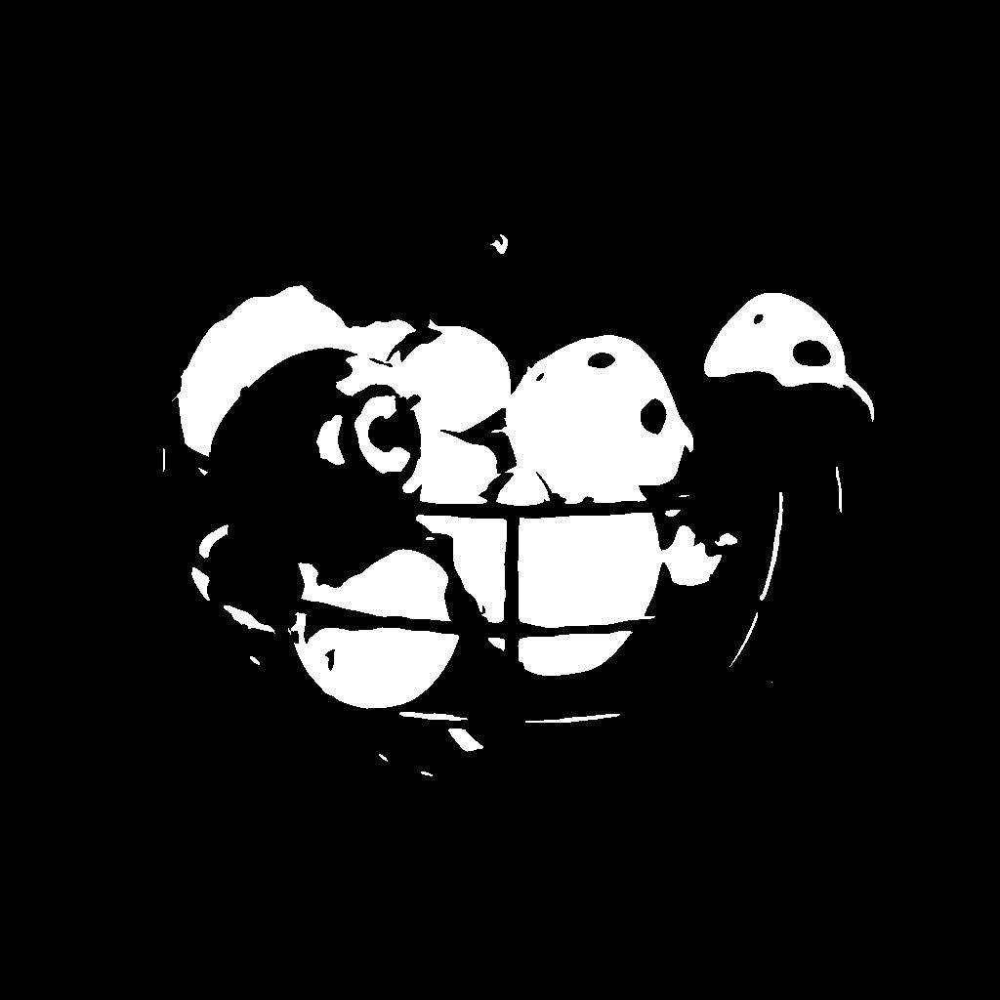

# 用于遮盖灰度的ID

<table>
<tr style="border: 0;">
<td width="33.33%" style="border: 0;" valign="top">

{width="200px"}

<b>英寸：</b>滤镜>调整

</td>
<td width="100.00%" style="border: 0;" valign="top">

## 描述

在包含选定像素值的像素为白色的Id 图外创建蒙版。

id 图是指作为整体（如形状）一部分的像素都包含相同唯一标识值的图像。 在这种情况下，该值是一个整数。

</td>
</tr>
</table>

<table>
<tr style="border: 0;">
<td style="border: 0;" valign="top">

</td>
<td style="border: 0;" valign="top">

### 输出连接器

</td>
<td style="border: 0;" valign="top">

### 参数

</td>
</tr>
</table>

## 输入连接器

|  |  |
| --- | --- |
| <b>ID</b> *灰度*&#x200B;主要 | 应从中提取蒙版的输入Id 图。 |

## 输出连接器

|  |  |
| --- | --- |
| <b>输出</b> *灰度* | 从输入Id 图中提取的二进制蒙版。 |

## 参数

|  |  |
| --- | --- |
| <b>选择模式</b> *整数* | 选择Id 图中应该为白色在蒙版中的像素值的方法：<ul data-preserve-html="true"> <li data-preserve-html="true"><b>独奏：</b>选择单个像素值</li> <li data-preserve-html="true"><b>范围：</b>选择像素值范围</li> </ul> |
| <b>ID整数</b> *整数* *在“选择模式”设置为“独奏”时可用* | id 图中输出蒙版中应为白色的像素值。 |
| <b>ID范围</b> *整数2* *在“选择模式”设置为“范围”时可用* | ID映射中像素值的范围（从开始到结束），它在输出蒙版中应为白色。 |

## 示例

<table>
  <tr>
    <td>
      
       <i>之前</i>
    </td>
    <td>
      
       <i>之后</i>
    </td>
  </tr>
</table>

<table>
<tr style="border: 0;">
<td style="border: 0;" valign="top">

{zoomable="yes"}

</td>
<td style="border: 0;" valign="top">

{zoomable="yes"}

</td>
</tr>
</table>
