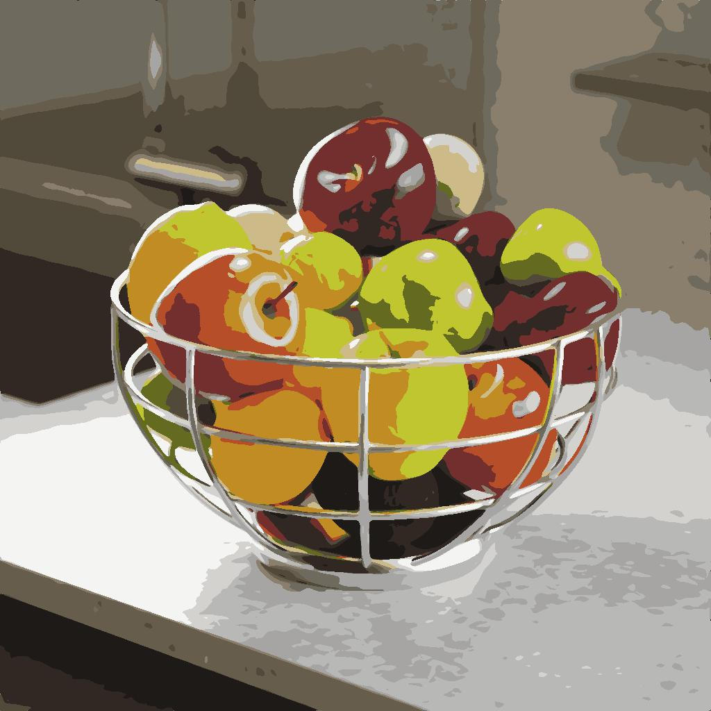

# 修改调色板

<table>
<tr style="border: 0;">
<td width="33.33%" style="border: 0;" valign="top">

{width="200px"}

<b>英寸：</b>滤镜>调整

</td>
<td width="100.00%" style="border: 0;" valign="top">

## 描述

修改有序调色板中的颜色，并使用ID映射将其应用于图像。

通过将ID映射中的索引与调色板中的颜色索引进行匹配，可以选择颜色。

例如，调色板中的颜色#2将应用于ID映射中ID值为2的所有像素。

此节点可以与以下节点结合使用： [量化颜色](../../../../../../compositing-graphs/nodes-reference-for-com/node-library/filters/adjustments/quantize-color/quantize-color.md)、[创建调色板](../../../../../../compositing-graphs/nodes-reference-for-com/node-library/filters/adjustments/create-color-palette-16/create-color-palette-16.md)、[应用调色板](../../../../../../compositing-graphs/nodes-reference-for-com/node-library/filters/adjustments/apply-color-palette/apply-color-palette.md)、[查看调色板](../../../../../../compositing-graphs/nodes-reference-for-com/node-library/filters/adjustments/view-color-palette/view-color-palette.md)。

</td>
</tr>
</table>

## 输入

|  |  |
|:---|:---|
| <b>ID</b> <i>灰度</i>主要 | 用于选择颜色的输入ID映射，以便在输出中修改和分布颜色。   ID图是整体像素（如形状）全部包含相同唯一标识值的图像。 在本例中，该值是一个整数。   可以使用[Quantize Color](../../../../../../compositing-graphs/nodes-reference-for-com/node-library/filters/adjustments/quantize-color/quantize-color.md)节点生成ID映射。 |
| <b>调色板</b> <i>颜色</i> | 以像素行编码的RGB的有序列表。 调色板最多可包含256种颜色。 这是节点修改的调色板。   可以使用[量化颜色](../../../../../../compositing-graphs/nodes-reference-for-com/node-library/filters/adjustments/quantize-color/quantize-color.md)或[创建调色板](../../../../../../compositing-graphs/nodes-reference-for-com/node-library/filters/adjustments/create-color-palette-16/create-color-palette-16.md)节点来生成调色板。 |

## 输出

|  |  |
|:---|:---|
| <b>输出</b> <i>颜色</i> | 将修改的调色板中的颜色映射到ID映射的索引的结果。 |
| <b>调色板</b> <i>颜色</i> | 应用了指定颜色修改的更新调色板。   该调色板可应用于具有[应用调色板](../../../../../../compositing-graphs/nodes-reference-for-com/node-library/filters/adjustments/apply-color-palette/apply-color-palette.md)节点的其他图像，或用[查看调色板](../../../../../../compositing-graphs/nodes-reference-for-com/node-library/filters/adjustments/view-color-palette/view-color-palette.md)节点可视化。 |

## 参数

|  |  |
|:---|:---|
| <b>颜色选择模式</b> *整数* | 在调色板中选择应修改的目标颜色的方法：<ul data-preserve-html="true"> <li data-preserve-html="true"><b>颜色索引：</b>目标颜色的索引</li> <li data-preserve-html="true"><b>图像空间：</b>ID映射中应该对索引采样的位置。 选择此模式后，可在2D视图中使用位置小工具以便于选择</li> </ul> |
| <b>颜色位置</b> *浮点2* *在“颜色选择模式”设置为“图像空间”时可用* | 在ID映射中应该对索引进行采样的位置。   使用2D视图中的小工具可轻松选择图像中的位置。   提示：您可以显示从中提取ID映射的量化图像，然后选择“修改调色板”节点以显示小工具。 这使得选择要修改的颜色更加直观。 |
| <b>颜色索引</b> *整数* *在“颜色选择模式”设置为“颜色索引”时可用* | 目标颜色的索引。   调色板中的颜色按从左到右的顺序排列，第一种颜色的索引是0。 |
| <b>颜色选区跨页</b> *浮动* | 控制选区到邻近颜色的距离。   在&#x200B;*立方体*&#x200B;中排列颜色，其宽度、Height和深度是渐变，其中颜色的每个分量从0增加到1(例如 红、绿、蓝RGB)。   此参数调整立方体中选定颜色周围的距离，其他颜色也可以修改，其中1是整个立方体的宽度。 |
| <b>颜色选区对比度</b> *浮动* | 控制选区在相邻颜色上的衰减渐变。   在&#x200B;*立方体*&#x200B;中排列颜色，其宽度、Height和深度是渐变，其中颜色的组分从0增加到1(例如， 红、绿、蓝RGB)。   此参数用于在立方中选定颜色周围的其他颜色上调整选区衰减，其中0是从选定颜色到最远的平滑渐变，1是从完全包含到不包含的切除。 |
| <b>距离色彩空间</b> *整数* | 在&#x200B;*立方体*&#x200B;中排列颜色，其宽度、Height和深度是渐变，其中颜色的组分从0增加到1(例如， 红、绿、蓝RGB)。   此参数允许您选择用于在立方体中分布颜色的色彩空间，这将更改邻近颜色。   您可以选择适合您用例的色彩空间：<ul data-preserve-html="true"> <li data-preserve-html="true"><b>Lab（颜色）：</b>标准的可感知色彩空间，它以这样一种方式分配颜色，“感觉”接近的颜色实际上在立方体中靠近。 这适合用于显示器上可能显示的图像。</li> <li data-preserve-html="true"><b>RGB（数据）：</b>颜色被分为红色、绿色和蓝色，并沿这些轴直接分布，而不考虑人类的感觉。 这适合用于包含原始数据的图像，例如正常映射。</li> </ul> |
| <b>模式</b> *整数* | 修改目标颜色的方法：<ul data-preserve-html="true"> <li data-preserve-html="true"><b>覆盖颜色：</b>将颜色替换为另一种颜色</li> <li data-preserve-html="true"><b>HSL：</b>使用色相、饱和度和亮度偏移调整颜色</li> </ul> |
| <b>不透明度</b> *浮动* | 控制原始颜色和修改后的颜色之间的插值，其中1表示修改后的颜色将完全替换原始颜色。 |
| <b>覆盖颜色</b> *Float3* *在“模式”设置为“覆盖颜色”时可用* | 指定应替换原始颜色的颜色。 |
| <b>HSL</b> *Float3* *在“模式”设置为“HSL”时可用* | 控制应用于原始颜色的色相、饱和度和亮度偏移。 |

## 示例

{zoomable="yes"}

{zoomable="yes"}

<table>
  <tr>
    <td>
      
       <i>之前</i>
    </td>
    <td>
      
       <i>之后</i>
    </td>
  </tr>
</table>
