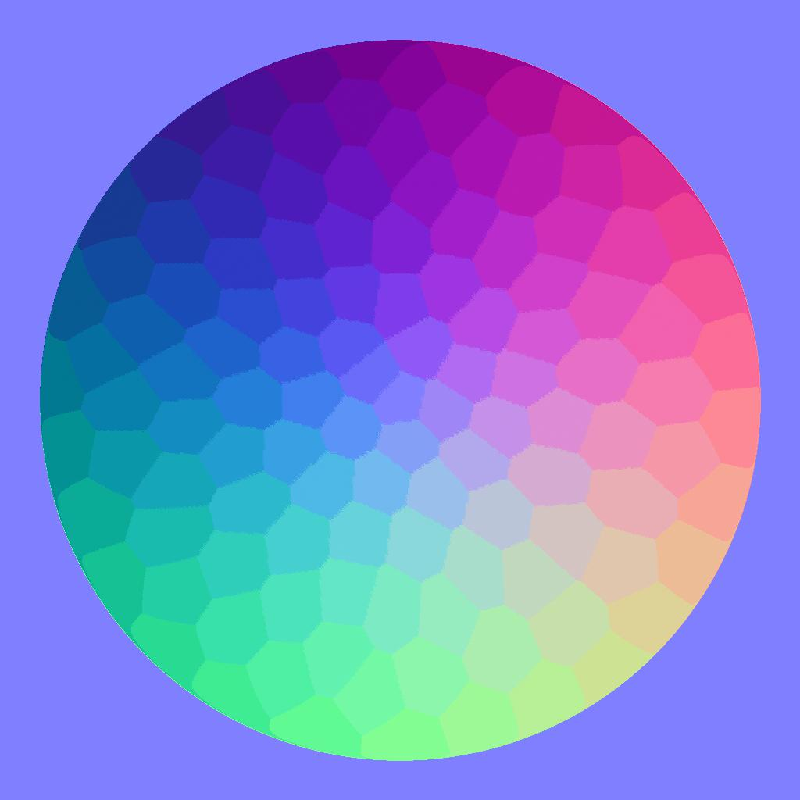

# 量化颜色

<table>
<tr style="border: 0;">
<td width="33.33%" style="border: 0;" valign="top">

{width="200px"}

<b>英寸：</b>滤镜>调整

</td>
<td width="100.00%" style="border: 0;" valign="top">

## 描述

减少彩色图像中的颜色量，从而有效地拼合渐变。

除了处理图像外，节点还提取以下内容：

* 其余颜色的<b>调色板</b>，可用于为其他图像着色
* 量化区域的<b>ID映射</b>，可用于使用不同的调色板为处理的图像重新着色
* 作为原始整数值的剩余颜色的<b>数量</b>

</td>
</tr>
</table>

如果将“忽略Alpha”参数设置为“假”，则使用原始图像的Alpha通道来选择在量化过程中应从中提取颜色的图像区域，而忽略透明区域中的颜色。

这有效地提供了对提取颜色的一些控制。

此节点可以与以下节点结合使用： [创建调色板](../../../../../../compositing-graphs/nodes-reference-for-com/node-library/filters/adjustments/create-color-palette-16/create-color-palette-16.md)、[应用调色板](../../../../../../compositing-graphs/nodes-reference-for-com/node-library/filters/adjustments/apply-color-palette/apply-color-palette.md)、[修改调色板](../../../../../../compositing-graphs/nodes-reference-for-com/node-library/filters/adjustments/modify-color-palette/modify-color-palette.md)、[查看调色板](../../../../../../compositing-graphs/nodes-reference-for-com/node-library/filters/adjustments/view-color-palette/view-color-palette.md)。

## 输入

|  |  |
|:---|:---|
| <b>输入</b> <i>颜色</i>主要 | 应量化的彩色图像。 |

## 输出

|  |  |
|:---|:---|
| <b>输出</b> <i>颜色</i> | 量化彩色图像。 |
| <b>ID</b> <i>灰度</i> | 为每个量化颜色分配唯一整数标识符的映射。   这可用于：<ul data-preserve-html="true"> <li data-preserve-html="true">使用[ID到蒙版](../../../../../../compositing-graphs/nodes-reference-for-com/node-library/filters/adjustments/id-to-mask/id-to-mask.md)节点<b>从某些量化区域中提取蒙版</b></li> <li data-preserve-html="true">使用[应用调色板](../../../../../../compositing-graphs/nodes-reference-for-com/node-library/filters/adjustments/apply-color-palette/apply-color-palette.md)或[修改调色板](../../../../../../compositing-graphs/nodes-reference-for-com/node-library/filters/adjustments/modify-color-palette/modify-color-palette.md)节点<b>重新着色</b>量化图像</li> </ul> |
| <b>调色板</b> <i>颜色</i> | 从图像中提取的调色板，保留量化后剩余的颜色。   图像是编码为像素行的RGB的有序列表，最多可包含256种颜色。   可以使用[查看调色板](../../../../../../compositing-graphs/nodes-reference-for-com/node-library/filters/adjustments/view-color-palette/view-color-palette.md)节点来可视化调色板。 |
| <b>调色板颜色量</b> <i>整数</i> | 调色板中存储的颜色量。 |

## 参数

|  |  |
|:---|:---|
| <b>最大 颜色量</b> *整数* | 量化图像应使用的最大颜色量。   此数量与从图像中提取的调色板中使用的数量相同。  “最大值”表示由于使用了量化技术，可能无法满足此金额。 检查“调色板颜色数量”输出以查看实际提取的颜色数量。 |
| <b>轮廓平滑</b> *浮动* | 控制应用于输入图像的平滑效果的半径，用于将量化图像简化为更坚实、更有凝聚力的形状。   注意：此平滑操作需要密集的计算，因此提高此值会显着增加节点的计算时间。 |
| <b>仿色</b> *浮动* | 应用仿色图案以在原始图像中重新创建渐变和颜色混合，同时仍仅使用量化后剩余的颜色。   确保使用“轮廓平滑”值0产生预期的仿色效果。 |
| <b>抖动模式</b> *整数* | 用于在原始图像中重新创建渐变和颜色混合的抖动图案：<ul data-preserve-html="true"> <li data-preserve-html="true">蓝色杂色</li> <li data-preserve-html="true">拜耳</li> </ul> |
| <b>忽略Alpha</b> *布尔值* | 默认情况下，原始图像的Alpha通道用于选择在量化过程中应从中提取颜色的图像区域，而透明区域中的颜色会被忽略。 这有效地提供了对提取颜色的一些控制。   实际上，您可能希望仅使用图像的可见部分中的颜色来进行量化。   此切换功能可让您禁用此蒙版并使用&#x200B;*完整*&#x200B;图像，而不考虑透明度。 |
| <b>距离色彩空间</b> *整数* | 在&#x200B;*立方体*&#x200B;中排列颜色，其宽度、Height和深度是渐变，其中颜色的每个分量从0增加到1(例如 红、绿、蓝RGB)。   量化过程包括在图像中选择&#x200B;*定义颜色*，然后在立方体中查找与其最接近的颜色并用该定义颜色替换它们。   此参数允许您选择用于在立方体中分布颜色的色彩空间，该色彩空间通过更改检测定义颜色和重新排列相邻颜色的标准来更改量化结果。   您可以选择适合您用例的色彩空间：<ul data-preserve-html="true"> <li data-preserve-html="true"><b>Lab（颜色）：</b>标准的可感知色彩空间，它以这样一种方式分配颜色，“感觉”接近的颜色实际上在立方体中靠近。 这适合用于显示器上可能显示的图像</li> <li data-preserve-html="true"><b>RGB（数据）：</b>颜色被分为红色、绿色和蓝色，并沿这些轴直接分布，而不考虑人类的感觉。 这适合用于包含原始数据的图像，例如正常映射</li> </ul> |
| <b>ID排序模式</b> *整数* | 在&#x200B;*立方体*&#x200B;中排列颜色，其中宽度、Height和深度是渐变，其中颜色的每个分量从0增加到1(例如 红、绿、蓝RGB)。   此参数选择用于对提取的调色板中的颜色列表以及提取的Id 图区域中的索引进行排序的方法：<ul data-preserve-html="true"> <li data-preserve-html="true"><b>Z曲线：</b>颜色会根据Z曲线在颜色立方体中找到的下一个颜色进行排序（从白色到黑色）</li> <li data-preserve-html="true"><b>色相：</b>颜色按最接近的色相排序</li> <li data-preserve-html="true"><b>代表性：</b>颜色在量化图像中使用率从高到低排序</li> </ul> |
| <b>缩放筛选</b> *整数* | 该颜色量化过程涉及计算图像在减小尺寸（即缩放）下的直方图，以便按重要性对其颜色进行排序。 此参数控制在计算其直方图之前筛选缩小图像的方法：<ul data-preserve-html="true"> <li data-preserve-html="true"><b>双线性：</b>将双线性筛选应用于图像，生成带有插值颜色的直方图，这些插值颜色可能不是原始图像的一部分，从而稀释了某些原始颜色。 这有助于处理使用多种颜色的图像。</li> <li data-preserve-html="true"><b>最接近的：</b>对最接近的像素的颜色进行采样，不使用筛选，从而生成只使用原始图像中的颜色的直方图。 这适合使用少量颜色的图像。</li> </ul> |

## 示例

<table>
  <tr>
    <td>
      
       <i>之前</i>
    </td>
    <td>
      
       <i>之后</i>
    </td>
  </tr>
</table>

<table>
  <tr>
    <td>
      
       <i>之前</i>
    </td>
    <td>
      
       <i>之后</i>
    </td>
  </tr>
</table>

<table>
  <tr>
    <td>
      
       <i>之前</i>
    </td>
    <td>
      
       <i>之后</i>
    </td>
  </tr>
</table>

<table>
  <tr>
    <td>
      
       <i>之前</i>
    </td>
    <td>
      
       <i>之后</i>
    </td>
  </tr>
</table>

<table>
  <tr>
    <td>
      
       <i>之前</i>
    </td>
    <td>
      
       <i>之后</i>
    </td>
  </tr>
</table>
