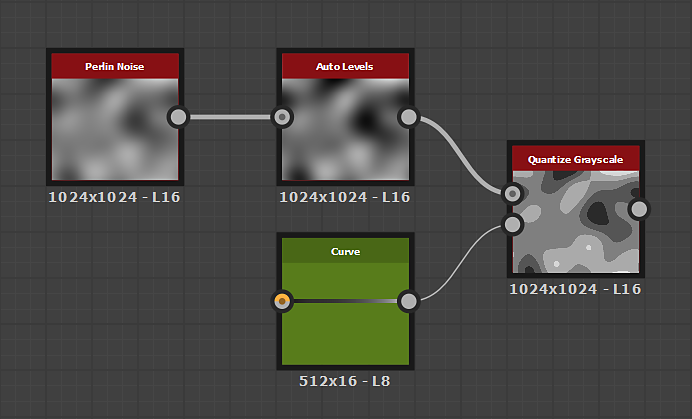

# 量化灰度

<table>
<tr style="border: 0;">
<td width="33.33%" style="border: 0;" valign="top">

{width="200px"}

<b>英寸：</b>滤镜>调整

</td>
<td width="100.00%" style="border: 0;" valign="top">

## 描述

生成一个圆形的单个样条。

</td>
</tr>
</table>

## 参数

<b>步骤</b> *整数*&#x200B;输入范围应该接近的单独值的数目。

<b>偏移</b> *浮动*&#x200B;将偏移应用于输入范围，这将沿该范围&#x200B;*移动*&#x200B;结果。

<b>斜率</b> *浮动*&#x200B;将斜率渐变应用于近似值之间的&#x200B;*过渡*，最大可达步骤的&#x200B;*全宽*。

<b>斜率曲线</b> *整数*&#x200B;设置获取由<b>斜率</b>参数设置的斜率的曲线的方法：
* *线性*：应用线性曲线，生成直线斜率
* *平滑步骤*：应用平滑步骤曲线，从而产生平滑斜率
* *曲线输入*：应用<b>曲线输入</b>输入映射描述的曲线。 您可以使用[曲线](../../../../../../compositing-graphs/nodes-reference-for-com/atomic-nodes/curve/curve.md)节点通过大量控制来描述此曲线。

## 示例

