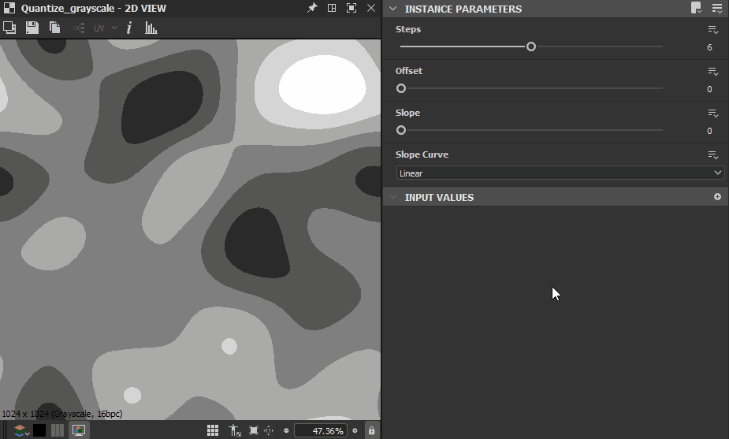

# 量化灰度

<table>
<tr style="border: 0;">
<td width="33.33%" style="border: 0;" valign="top">

{width="200px"}

<b>英寸：</b>滤镜>调整

</td>
<td width="100.00%" style="border: 0;" valign="top">

## 描述

生成一个圆形的单个样条。

</td>
</tr>
</table>

## 参数

|  |  |
|:---|:---|
| <b>步骤</b> *整数* | 输入范围应接近的单独值的数目。 |
| <b>偏移</b> *浮动* | 将偏移应用于输入范围，该范围会&#x200B;*沿该范围移动*&#x200B;结果。 |
| <b>斜率</b> *浮动* | 将斜率渐变应用于近似值之间的&#x200B;*过渡*，最大为步骤的&#x200B;*全宽*。 |
| <b>斜率曲线</b> *整数* | 设置获取由<b>斜率</b>参数设置的斜率集的曲线的方法：<ul data-preserve-html="true"> <li data-preserve-html="true">*线性*：应用线性曲线，生成直线斜率</li> <li data-preserve-html="true">*平滑步骤*：应用平滑步骤曲线，从而产生平滑斜率</li> <li data-preserve-html="true">*曲线输入*：应用<b>曲线输入</b>输入图描述的曲线。 您可以使用[曲线](../../../../../../compositing-graphs/nodes-reference-for-com/atomic-nodes/curve/curve.md)节点通过大量控制来描述此曲线。</li> </ul> |

## 示例

