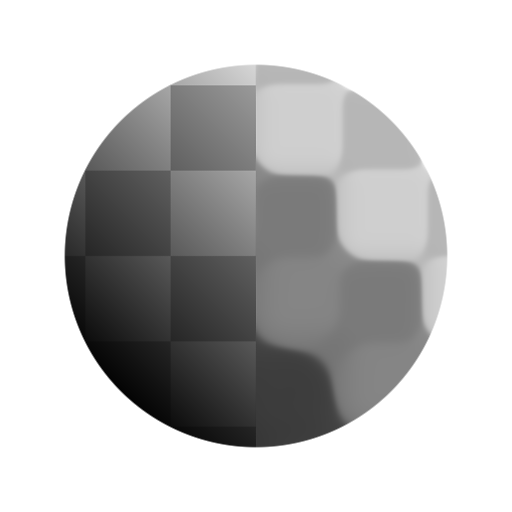

# MLV灰度

<table>
<tr style="border: 0;">
<td width="33.33%" style="border: 0;" valign="top">

<b>英寸：</b>滤镜>模糊

</td>
<td width="100.00%" style="border: 0;" valign="top">

## 描述

MLV表示<b>“最小方差平均值”</b>。 此滤镜增强图像的边缘并使噪声变得平滑。

此滤镜查找图像中的结构区域，并使用它们来锐化和拼合图像。 在某些情况下，这可能会导致沿比结构区域宽的渐变执行步骤。

</td>
</tr>
</table>

>[!NOTE]
>
> 另请参阅[MLV颜色](../../../../../../compositing-graphs/nodes-reference-for-com/node-library/filters/blurs/mlv-color/mlv-color.md)。

## 输入

|  |  |
|:---|:---|
| <b>输入</b> <i>灰度</i> | 应处理的灰度图像。 |

## 输出

|  |  |
|:---|:---|
| <b>输出</b> <i>灰度</i> | 已筛选的灰度图像。 |

## 参数

|  |  |
|:---|:---|
| <b>强度</b> *Float* | 应用于图像的筛选的强度。  值越高，细节的平滑程度越高，平面区域的噪声越平滑。 |
| <b>Smoothness</b> *Float* | 应用于结构化区域的平滑强度，这会导致区域变圆并减小在较高的筛选强度下可能出现的步进效果。 |
| <b>条件</b> *整数* | 用于选择将定义图像中结构区域的值的标准。  换言之，像素应如何&#x200B;*分组*&#x200B;到应平滑的区域中。  *— 方差：*&#x200B;选择在平均值周围具有最低色散的值，这将导致像素群集彼此相似&#x200B; *— 变异系数：*&#x200B;在考虑到平均值的情况下选择值，这将导致较亮区域反向变化较小 |
| <b>高斯</b> *布尔值* | 使用高斯分布将像素分组到结构化区域。  当值为“True”时，这将使区域更平滑，并减小拼合效果。 |
| <b>迭代</b> *整数* | 运行筛选器的次数，其中每个迭代都应用于前一个规则的结果。  更多的迭代会产生更平坦、更锐化的结构区域。 |

## 示例

<table>
  <tr>
    <td>
      
       <i>之前</i>
    </td>
    <td>
      
       <i>之后</i>
    </td>
  </tr>
</table>

<table>
  <tr>
    <td>
      
       <i>之前</i>
    </td>
    <td>
      
       <i>之后</i>
    </td>
  </tr>
</table>

<table>
  <tr>
    <td>
      
       <i>之前</i>
    </td>
    <td>
      
       <i>之后</i>
    </td>
  </tr>
</table>
