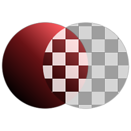

# Alpha拆分

<table>
<tr style="border: 0;">
<td width="33.33%" style="border: 0;" valign="top">

{width="128px"}

<b>范围：</b>滤镜>通道

</td>
<td width="100.00%" style="border: 0;" valign="top">

## 描述

删除并单出输入图像的Alpha。 另请参阅[Alpha合并](../../../../../../compositing-graphs/nodes-reference-for-com/node-library/filters/channels/alpha-merge/alpha-merge.md)以获取相反的结果。

分别输出去除了Alpha的图像和Alpha通道。

</td>
</tr>
</table>
