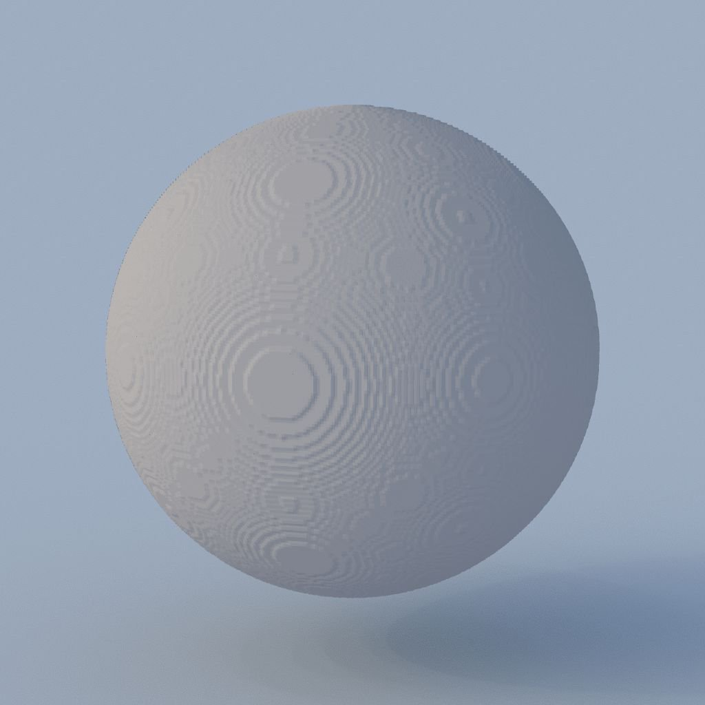

# 3D纹理表面渲染

<table>
<tr style="border: 0;">
<td width="41.60%" style="border: 0;" valign="top">

{width="200px"}

**范围：** *滤镜/效果*

**简单**

</td>
<td width="58.30%" style="border: 0;" valign="top">

## 描述

**3D纹理表面渲染**&#x200B;节点使用来自&#x200B;**3D距离场**&#x200B;图像输入的相应&#x200B;*距离场*&#x200B;渲染由&#x200B;*3D纹理*&#x200B;描述的形状的表面。

曲面在&#x200B;*单位立方体*&#x200B;的范围内表示。 使用映射到无限球的&#x200B;**环境**&#x200B;输入图像计算光照。

>[!NOTE]
>
> 距离场应为&#x200B;**4096x4096**&#x200B;纹理，用于描述&#x200B;**16x16**&#x200B;网格（256个切片）的形状。\
> 您可以使用[3D纹理SDF](../../../../../../compositing-graphs/nodes-reference-for-com/node-library/filters/effects/3d-texture-sdf/3d-texture-sdf.md)节点来计算256个切片的3D纹理的距离场。

</td>
</tr>
</table>

## 参数

### 输入

* **3D距离场** *灰度*\
  4096x4096图像表示形状的&#x200B;*距离场*&#x200B;的256个&#x200B;*切片*，排列在16x16网格中。\
  您可以使用[3D纹理SDF](../../../../../../compositing-graphs/nodes-reference-for-com/node-library/filters/effects/3d-texture-sdf/3d-texture-sdf.md)节点来计算256个切片的3D纹理的距离场。
* **环境** *颜色*\
  表示&#x200B;*环境*&#x200B;的图像，该图像应映射到渲染中的无限球体，并用于计算&#x200B;*光照*。\
  当&#x200B;**“背景模式”**&#x200B;参数设置为&#x200B;*“环境”*&#x200B;或&#x200B;*“环境”*&#x200B;时，也可使用该图像渲染场景背景。

### 参数

* **输出分辨率** *整数2*\
  **X**&#x200B;和&#x200B;**Y**&#x200B;中输出图像的分辨率，表示为&#x200B;*的二次方*。
* **相机位置** *浮点2*\
  形状周围相机的位置。\
  选择节点后，可以使用&#x200B;**2D视图**&#x200B;中的位置Gizmo将相机&#x200B;*绕轨*。
* **相机距离** *浮动*\
  从相机到形状的距离。
* **摄像机FOV** *浮动*\
  相机的视角&#x200B;*度*。
* **反照率** *浮点3*\
  形状表面的反照率。
* **背景模式** *整数*\
  表示渲染场景的背景的方法：
  * *地面辐照度*：计算的地面辐照度
  * *环境色*： **环境**&#x200B;图像输入的环境色映射到无限球体，类似于图像的强模糊版本
  * *统一颜色*：用指定颜色统一填充背景
  * *环境*： **环境**&#x200B;图像输入映射到无限球
* **背景颜色** *浮点4*\
  用于统一填充渲染场景背景的颜色。\
  *注意*：仅当&#x200B;**背景模式**&#x200B;参数设置为&#x200B;*统一颜色*&#x200B;时，此参数才可用。
* **启用地平面** *布尔值*\
  当&#x200B;*True*&#x200B;时，渲染地平面。 包围形状的&#x200B;*单位立方体*&#x200B;位于此平面上。
* **无限平面** *布尔值*\
  将地平面设置为&#x200B;*无限延伸*&#x200B;到地平线。\
  *注意*：仅当&#x200B;**启用地平面**&#x200B;参数设置为&#x200B;*True*&#x200B;时，此参数才可用。
* **地平面大小** *浮点2*&#x200B;调整地平面的大小。\
  *注意*：仅当&#x200B;**启用地平面**&#x200B;参数设置为&#x200B;*True*&#x200B;且&#x200B;**无限平面**&#x200B;参数设置为&#x200B;*False*&#x200B;时，此参数才可用。

## 示例图像

<table>
<tr style="border: 0;">
<td style="border: 0;" valign="top">

{width="256px"}

</td>
<td style="border: 0;" valign="top">

{width="256px"}

</td>
<td style="border: 0;" valign="top">

{width="256px"}

</td>
<td style="border: 0;" valign="top">

{width="256px"}

</td>
<td style="border: 0;" valign="top">

{width="512px"}

</td>
</tr>
</table>
