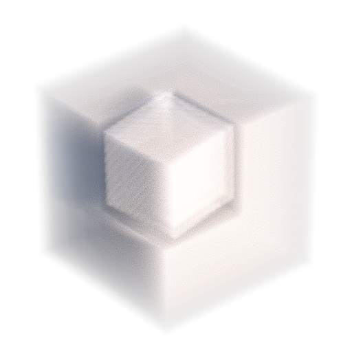
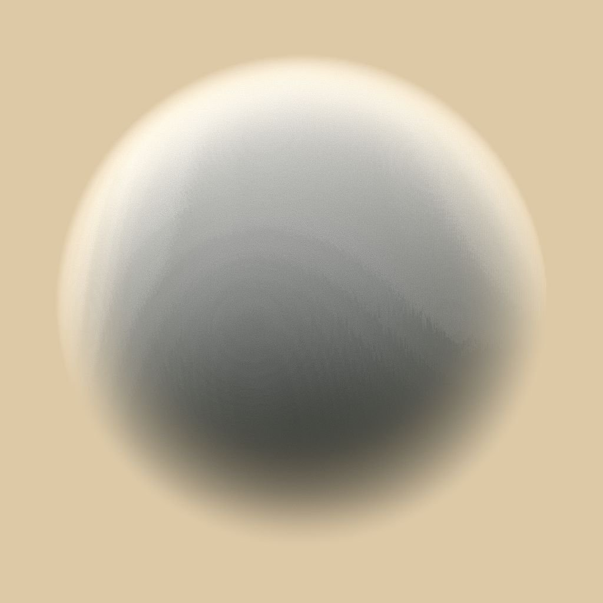

# 3D纹理体积渲染

<table>
<tr style="border: 0;">
<td width="33.33%" style="border: 0;" valign="top">

{width="200px"}

<b>进入：</b>滤镜>效果

</td>
<td width="100.00%" style="border: 0;" valign="top">

## 描述

**3D纹理体积渲染**&#x200B;节点使用其从&#x200B;**3D纹理**&#x200B;图像输入中相应的&#x200B;*带符号的距离字段*&#x200B;渲染&#x200B;*3D符号距离场*&#x200B;描述的形状的体积。

卷在&#x200B;*单位多维数据集*&#x200B;的范围内表示。 使用&#x200B;*定向光*&#x200B;和&#x200B;*半球天空光*&#x200B;计算光照。

>[!NOTE]
>
> 带符号的距离字段应为&#x200B;**4096x4096**&#x200B;纹理，用于描述具有256个切片的&#x200B;**16x16**&#x200B;网格的形状。\
> 您可以使用[3D纹理SDF](../../../../../../compositing-graphs/nodes-reference-for-com/node-library/filters/effects/3d-texture-sdf/3d-texture-sdf.md)节点为256个切片的3D纹理计算有符号距离字段。

</td>
</tr>
</table>

## 输入

|  |  |
|:---|:---|
| <b>3D符号距离场</b> <i>灰度</i> | 4096x4096图像表示形状的<i>符号距离场</i>的256个<i>切片</i>，以16x16网格排列。 您可以使用[3D纹理SDF](../../../../../../compositing-graphs/nodes-reference-for-com/node-library/filters/effects/3d-texture-sdf/3d-texture-sdf.md)节点为256个切片的3D纹理计算带符号距离字段。 |
| <b>密度</b> <i>灰度</i> | 4096x4096图像表示形状的<i>密度</i>的256个<i>切片</i>，以16x16网格排列。 密度使用从0（完全透明）到1（完全不透明）的灰度值映射。 您可以使用[3D体积蒙版](../../../../../../compositing-graphs/nodes-reference-for-com/node-library/texture-generators/patterns/3d-volume-mask/3d-volume-mask.md)或3D噪声节点（[3D Perlin噪声](../../../../../../compositing-graphs/nodes-reference-for-com/node-library/texture-generators/noises/3d-perlin-noise/3d-perlin-noise.md)、[3D Voronoi](../../../../../../compositing-graphs/nodes-reference-for-com/node-library/texture-generators/noises/3d-voronoi/3d-voronoi.md)、[3D Ridged噪声分形](../../../../../../compositing-graphs/nodes-reference-for-com/node-library/texture-generators/noises/3d-ridged-noise-fractal/3d-ridged-noise-fractal.md)等），结合[3D纹理位置](../../../../../../compositing-graphs/nodes-reference-for-com/node-library/filters/effects/3d-texture-position/3d-texture-position.md)节点作为位置输入，生成作为256个切片的3D纹理的体积蒙版。 |

## 参数

|  |  |
|:---|:---|
| <b>输出分辨率</b> <i>整数2</i> | <b>X</b>和<b>Y</b>中输出图像的分辨率，表示为<i>的二次方</i>。 |
| <b>相机位置</b> <i>浮点2</i> | 形状周围的相机位置。 选择节点后，可以使用<b>2D 视图</b>中的位置Gizmo来<i>轨道</i>相机。 |
| <b>光源位置</b> <i>浮点2</i> | <i>定向光</i>在形状周围的位置。 选择节点后，可以使用<b>2D 视图</b>中的位置Gizmo来<i>绕轨</i>光源。 |
| <b>相机距离</b> <i>浮动</i> | 从相机到形状的距离。 |
| <b>相机FOV</b> <i>浮动</i> | 相机的视角<i>度</i>。 |
| <b>吸收</b> <i>浮动</i> | 调整光线通过<i>到</i>音量时吸收的光量。 |
| <b>羽化</b> <i>浮动</i> | 将<b>密度</b>输入提供的值与<i>内部</i>距离字段值相乘。 这能有效地将<i>渐隐渐变</i>的宽度从卷的外部限制向内调整。 |
| <b>浅色模式</b> <i>整数</i> | 设置获取定向光颜色的方法：  - <i>色温（开氏度）</i>：颜色由光温决定，其中<i>较低</i>的值将产生<i>更暖</i>的RGB - <i>颜色颜色</i>：使用RGB值定义颜色 |
| <b>光温（开氏温度）</b> <i>浮动</i> | 影响其<i>颜色</i>的定向光的温度。 <i>较低</i>的值会产生<i>暖色</i>色。 有用值： 1800 K — 蜡烛光 2800 K — 白炽灯泡 5500 K — 日光 6200 K — 自然白色 7000 K — 阴天天空 <i>注意</i>：仅当<b>浅色模式</b>参数设置为<i>温度（开氏度）</i>时，此参数才可用。 |
| <b>浅色</b> <i>浮点3</i> | 定向光的颜色。 <i>注意</i>：仅当<b>浅色模式</b>参数设置为<i>RGB颜色</i>时，此参数才可用。 |
| <b>光照强度</b> <i>浮动</i> | 定向光的强度。 |
| <b>环境色</b> <i>浮点3</i> | 环境天光的颜色。 |
| <b>环境强度</b> <i>浮动</i> | 环境天光的强度。 |
| <b>反照率</b> <i>浮点3</i> | 体积块的反照率。 |
| <b>背景模式</b> <i>整数</i> | 基于<b>背景颜色</b>： - <i>阴影</i>着色渲染场景背景的方法：颜色受定向光的<i>颜色</i>和<i>强度</i> - <i>常量颜色</i>影响：颜色统一应用<i>而不考虑定向光</i> |
| <b>背景颜色</b> <i>浮点4</i> | 用于填充渲染场景的背景的颜色。 |
| <b>仿色</b> <i>浮动</i> | 调整用于平滑着色的<i>蓝色噪声仿色</i>的强度。 |
| <b>启用地面平面</b> <i>布尔值</i> | 当<i>True</i>时，渲染<i>无限</i>地面平面。 包围形状的<i>单位立方体</i>位于此平面上。 |
| <b>无限平面</b> <i>布尔值</i> | 将地面平面设置为<i>无限扩展</i>到水平线。 <i>注意</i>：仅当<b>启用地面平面</b>参数设置为<i>True</i>时，此参数才可用。 |
| <b>地面的平面大小</b> <i>浮点2</i> | 调整地面平面的大小。 <i>注意</i>：仅当<b>启用地面平面</b>参数设置为<i>True</i>且<b>无限平面</b>参数设置为<i>False</i>时，此参数才可用。 |

## 示例

<table style="margin-top: 32px; margin-bottom: 32px">
    <tr style="border: 0">
        <td style="border: 0; background: transparent">
            
        </td>
        <td style="border: 0; background: transparent">
            
        </td>
        <td style="border: 0; background: transparent">
            
        </td>
        <td style="border: 0; background: transparent">
            
        </td>
        <td style="border: 0; background: transparent">
            
        </td>
        <td style="border: 0; background: transparent">
            
        </td>
    </tr>
</table>
