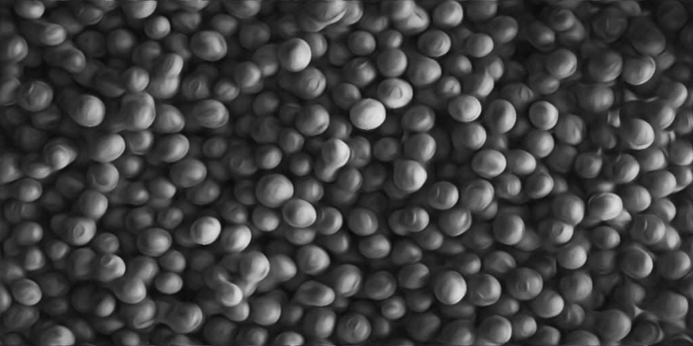
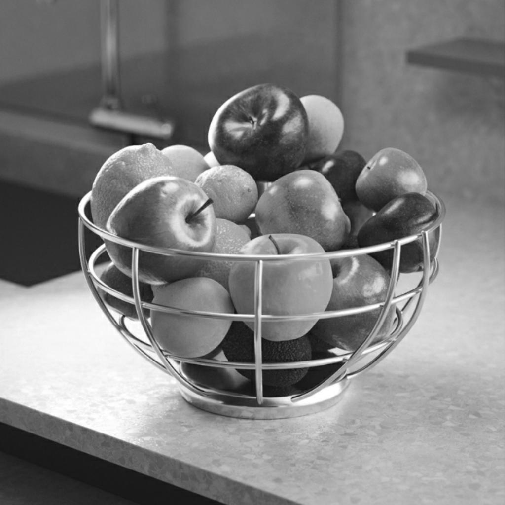

# 各向异性科威特灰度

<table>
<tr style="border: 0;">
<td width="33.33%" style="border: 0;" valign="top">

{width="200px"}

<b>英寸：</b>滤镜>效果

</td>
<td width="100.00%" style="border: 0;" valign="top">

## 描述

应用符合图像细节的各向异性方向模糊。 结果是&#x200B;*沿形状内部方向流动*&#x200B;的图像。

此可调整模糊计算或接收&#x200B;*方向图*&#x200B;以确定该流量，该流量可锐化到更平坦、定义更清晰的区域。

另请参阅： [各向异性科威特颜色](../anisotropic-kuwahara/anisotropic-kuwahara.md)

</td>
</tr>
</table>

通过旋转施加模糊的方向，也可以使所述流动破裂。 同样，也可以使用自定义方向图来覆盖从图像计算出来的颜色值。

此滤镜可以产生绘画效果，有助于进行风格化处理。

+++ 各向异性

流的强度主要受[各向异性](#parameters)参数控制，如下图所示。

左：各向异性0.0 /右：各向异性1.0

<table>
<tr style="border: 0;">
<td style="border: 0;" valign="top">

{zoomable="yes"}

</td>
<td style="border: 0;" valign="top">

{zoomable="yes"}

</td>
</tr>
</table>

+++

## 输入

|                                                       |                                                                                                                                                                                                                                                                                                                         |
|-------------------------------------------------------|-------------------------------------------------------------------------------------------------------------------------------------------------------------------------------------------------------------------------------------------------------------------------------------------------------------------------|
| <b>输入</b> <i>灰度</i> <code>主要</code> | 应处理的灰度图像。 |
| <b>各向异性角度映射</b> <i>灰度</i> | 灰度图像，描述应用于计算方向的附加旋转，其中灰度值是旋转数。   当“各向异性”参数设置为0时，映射仍然有效，因为它影响Kuwahara滤镜使用的内核旋转。 |
| <b>斜率映射</b> <i>灰度</i> | 根据“斜率映射输入乘数”参数值，表示方向图所匹配的斜率的映射。 |
| <b>Radius映射（可选）</b> <i>灰度</i> | 连接后，模糊的“半径”将乘以输入图像。 |
| <b>方向图</b> <i>颜色</i> | 描述各向异性滤镜内核使用的方向的映射。   当“各向异性”参数设置为0时，映射仍然有效，因为它影响Kuwahara滤镜使用的内核旋转。   注意：此输入仅在“使用输入方向图”参数设置为“True”时使用。 |

## 输出

|                                   |                                                                                                                                                                                                                                      |
|-----------------------------------|--------------------------------------------------------------------------------------------------------------------------------------------------------------------------------------------------------------------------------------|
| <b>输出</b> <i>灰度</i> | 节点对输入图像施加各向异性模糊的结果。 |
| <b>方向图</b> <i>颜色</i> | 从输入图像计算的方向图用于驱动各向异性模糊。   如果“使用输入方向图”参数设置为“True”，则会使用提供给“方向图”输入的图像，并按原样输出。 |

## 参数

|                                                                                                                              |                                                                                                                                                                                                                                                                               |
|------------------------------------------------------------------------------------------------------------------------------|-------------------------------------------------------------------------------------------------------------------------------------------------------------------------------------------------------------------------------------------------------------------------------|
| <b>半径</b> <i>浮动</i> | 模糊半径，值越高，模糊效果越强。   最大值为32。 |
| <b>Smoothness</b> <i>浮动</i> | 调整计算方向上的颜色混合量。   当该值为0时，颜色大部分在该方向上移位，并且很少发生混合。 |
| <b>锐度</b> <i>浮动</i> | 增加模糊区域的对比度，使其看起来更平滑，定义更清晰。 |
| <b>各向异性</b> <i>浮动</i> | 调整方向图在模糊处理中的作用。   当此参数值为0时，方向图及其所有修改量（参数和输入映射）仍然有效，因为该方向图在Kuwahara滤镜内核中使用。 |
| <b>使用输入方向图</b> <i>布尔值</i> | 当“True”时，不从输入图像计算任何方向图，并且使用连接到“方向图”输入的图像来驱动各向异性模糊。 |
| <b>张量Smoothness</b> <i>Float</i>  <i>在“使用输入方向图”设置为“False”时可用</i> | 调整应用于根据图像计算并存储在方向图中的方向的模糊强度。   当图像包含大量高频细节时，增加此值可确保获得更平滑的结果。 |
| <b>各向异性角度</b> <i>Float</i>  <i>在“使用输入方向图”设置为“False”时可用</i> | 按轮转次数向方向图添加旋转。   此附加旋转是&#x200B;*累积*，与“各向异性角度映射”输入指定的旋转相同。 |
| <b>各向异性的角度映射乘数</b> <i>Float</i>  <i>在“使用输入方向图”设置为“False”时可用</i> | 调整“各向异性角度映射”输入中值的强度，然后按轮次在应用于方向图的旋转顶部添加。   此附加旋转是&#x200B;*累积*，与“各向异性角度”参数指定的旋转相同。 |
| <b>斜率的地图输入乘数</b> <i>Float</i>  <i>在“使用输入方向图”设置为“False”时可用</i> | 调整方向图与“斜率映射”输入提供的斜率的匹配强度。 |

## 示例

<table>
  <tr>
    <td>
      
       <i>之前</i>
    </td>
    <td>
      
       <i>之后</i>
    </td>
  </tr>
</table>

<table>
  <tr>
    <td>
      
       <i>之前</i>
    </td>
    <td>
      
       <i>之后</i>
    </td>
  </tr>
</table>

<table>
  <tr>
    <td>
      
       <i>之前</i>
    </td>
    <td>
      
       <i>之后</i>
    </td>
  </tr>
</table>
