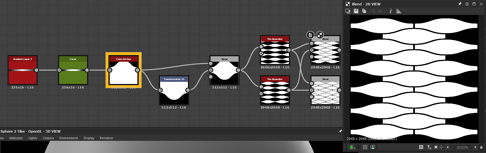

# 横截面

<table>
<tr style="border: 0;">
<td width="33.33%" style="border: 0;" valign="top">

{width="200px"}

<b>英寸：</b>滤镜>效果

</td>
<td width="100.00%" style="border: 0;" valign="top">

## 描述

绘制输入的横截面轮廓。 可以调整为切片垂直或水平，并具有绘图样式以及图形偏移和缩放控件。

</td>
</tr>
</table>

此节点对于调试和分析高度图特别有用。 为您提供完美像素配置文件视图，而无需在3D视图中复杂的节点或冗长且不太精确的设置。

或者，它可以用于创建其他方法很难实现的2D形状和轮廓。 与[曲线节点](../../../../../../compositing-graphs/nodes-reference-for-com/atomic-nodes/curve/curve.md)相结合，它可以直接可视化应用于线性渐变的曲线轮廓。

## 参数

<b>横截面坐标</b> *浮点*\
设置对切片采样的坐标。 取决于“截面轴”，可以是X或Y坐标。

<b>节轴</b> *整数*\
设置切片是垂直还是水平。

<b>显示帮助程序</b> *布尔值*\
启用叠加以在输入图像上显示部分的位置。

帮助程序设置

<b>帮助器缩放</b> *浮动*\
    以倍数表示的叠加大小，其中1.0表示整个图像。

<b>帮助器位置</b> *浮点2*\
    叠加在输出图像中的(X， Y)位置，其中(0.0， 0.0)是左上角，(1.0， 1.0)是右下角。

<b>Height缩放</b> *浮动*

缩小整个图表。 适用于HDR查看。

<b>Height偏移</b> *浮动*\
向上或向下移动整个图表。 适用于HDR查看。

<b>绘图样式</b> *整数*\
在纯色填充和线条绘制之间切换。

<b>反转渐变</b> *布尔型*&#x200B;如果绘制样式设置为&#x200B;*渐变*&#x200B;或&#x200B;*渐变镜像*，则允许您反转该渐变而不影响背景。\
*注意：*&#x200B;仅在“绘图样式”设置为“渐变”或“渐变镜像”时可用。

<b>平滑/多边形</b> *布尔值*\
在完美平滑轮廓或锯齿状多边形之间切换形状。\
*注意：*&#x200B;仅在“绘图样式”设置为“纯色”、“渐变”或“渐变镜像”时可用。

<b>段数量</b>： *整数*\
设置使用“多边形样式”或“线段样式”时用于绘制的线段数量。\
*注意：*&#x200B;仅在“平滑/多边形”设置为“多边形”或“绘图样式”设置为“直线”时可用。

<b>行Thickness</b> *浮动*\
设置线条的Thickness。\
*注意：*&#x200B;仅在“绘图样式”设置为“直线”时可用。

<b>线条样式</b> *整数*\
允许您选择线条的着色和衰减。\
*注意：*&#x200B;仅在“绘图样式”设置为“直线”时可用。

<b>行Smoothness</b> *浮动*\
设置线条的渐变衰减。\
*注意：*&#x200B;仅在“绘图样式”设置为“直线”时可用。

<b>颜色</b> *浮动*\
线条或形状的灰度颜色。\
*注意：*&#x200B;仅在“绘图样式”设置为“实心”或“线条”且“线段样式”设置为“平滑”或“实心”时可用。

<b>背景颜色</b> *浮动*&#x200B;背景的灰度颜色。\
*注意：*&#x200B;在“绘图样式”设置为“直线”并且“线段样式”设置为“线段ID”或“沿线渐变”时不可用。

## 示例

