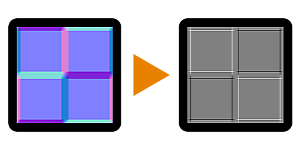

# 弯曲(滤镜节点)

<table>
<tr style="border: 0;">
<td width="33.33%" style="border: 0;" valign="top">

{width="128px"}

<b>英寸：</b>滤镜>效果

</td>
<td width="100.00%" style="border: 0;" valign="top">

## 描述

对输入[正常映射](../../../../../../compositing-graphs/nodes-reference-for-com/atomic-nodes/normal/normal.md)执行简单、苛刻的单程曲率转换。 生成的贴图具有凸形区域的白色色调和凹形区域的黑色色调。 曲率始终会产生像素细线和尖锐过渡。

此节点对于某些边缘的快速突出显示或变暗非常有用。 与[曲率光滑](../../../../../../compositing-graphs/nodes-reference-for-com/node-library/filters/effects/curvature-smooth/curvature-smooth.md)（可生成更高质量的结果）和[曲率光滑](../../../../../../compositing-graphs/nodes-reference-for-com/node-library/filters/effects/curvature-sobel/curvature-sobel.md)（具有更多选项）相比，它的作用有限。

</td>
</tr>
</table>

## 参数

|  |  |
|:---|:---|
| <b>强度</b> <i>0.0 - 10.0</i> | 效果的强度。 增加结果的对比度。 |
| <b>正常格式</b> <i>DirectX， OpenGL</i> | 在不同正常映射格式之间切换（反转绿色通道）。 |

## 示例

<table style="margin-top: 32px; margin-bottom: 32px">
    <tr style="border: 0">
        <td style="border: 0; background: transparent">
            
        </td>
    </tr>
</table>
