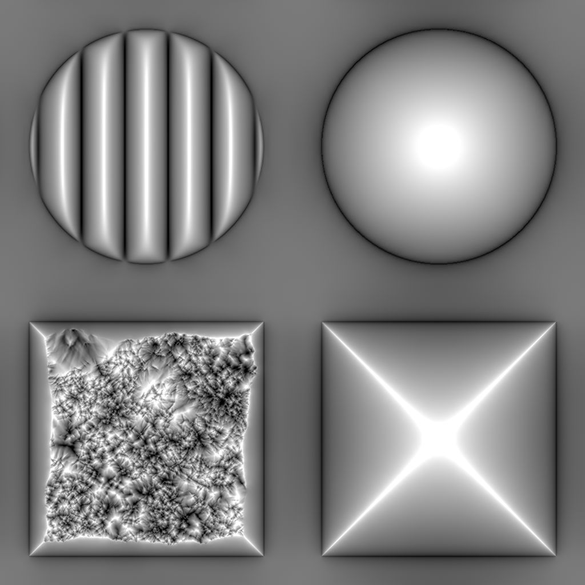

# 弯曲平滑

<table>
<tr style="border: 0;">
<td width="33.33%" style="border: 0;" valign="top">

{width="200px"}

<b>英寸：</b>滤镜>效果

</td>
<td width="100.00%" style="border: 0;" valign="top">

## 描述

计算由法线图描述的曲面的弯曲。

弯曲图表示曲面的凹和凸区域。\
平面区域为50%灰色。 凸出区域较亮，而凹入区域较暗。

</td>
</tr>
</table>

凹形和凸形区域也将分割为其自己的输出，以便根据这些特性更轻松地选择区域或对其进行蒙版。

>[!TIP]
>
> 查看[弯曲](../../../../../../compositing-graphs/nodes-reference-for-com/node-library/filters/effects/curvature-filter-node/curvature-filter-node.md)以获得更清晰的版本，或者[弯曲Sobel](../../../../../../compositing-graphs/nodes-reference-for-com/node-library/filters/effects/curvature-sobel/curvature-sobel.md)（如果需要更多选项）。

<table>
<tr style="border: 0;">
<td style="border: 0;" valign="top">

</td>
<td style="border: 0;" valign="top">

### 输出连接器

</td>
<td style="border: 0;" valign="top">

### 参数

</td>
</tr>
</table>

## 输入连接器

|  |  |
| --- | --- |
| <b>正常</b> *颜色* <b>主要</b> | 描述应计算弯曲的曲面的法线图。 |

## 输出连接器

|  |  |
| --- | --- |
| <b>弯曲</b> *灰度* | 从输入法线图计算的弯曲图。   平面区域为50%灰色。 凸出区域较亮，而凹入区域较暗。 |
| <b>凸性</b> *灰度* | 从输入法线图计算的凸度映射。   区域越凸起，地图中的区域就越亮。  平坦或凹进区域为黑色。 |
| <b>凹陷</b> *灰度* | 从输入法线映射计算出的凹面映射。   区域越凹陷，地图中的区域就越亮。  平坦或凸出区域为黑色。 |

## 参数

|  |  |
| --- | --- |
| <b>正常格式</b> *整数* | 输入法线图的格式。 有效地反转绿色通道。<ul data-preserve-html="true"> <li data-preserve-html="true"><b>DirectX：</b> Y轴指向上</li> <li data-preserve-html="true"><b style="">OpenGL：</b> Y轴指向下</li> </ul> |

## 示例

<table>
  <tr>
    <td>
      
       <i>之前</i>
    </td>
    <td>
      
       <i>之后</i>
    </td>
  </tr>
</table>

<table>
<tr style="border: 0;">
<td style="border: 0;" valign="top">

{zoomable="yes"}

</td>
<td style="border: 0;" valign="top">

{zoomable="yes"}

</td>
</tr>
</table>

<table>
  <tr>
    <td>
      
       <i>之前</i>
    </td>
    <td>
      
       <i>之后</i>
    </td>
  </tr>
</table>

<table>
<tr style="border: 0;">
<td style="border: 0;" valign="top">

{zoomable="yes"}

</td>
<td style="border: 0;" valign="top">

{zoomable="yes"}

</td>
</tr>
</table>
