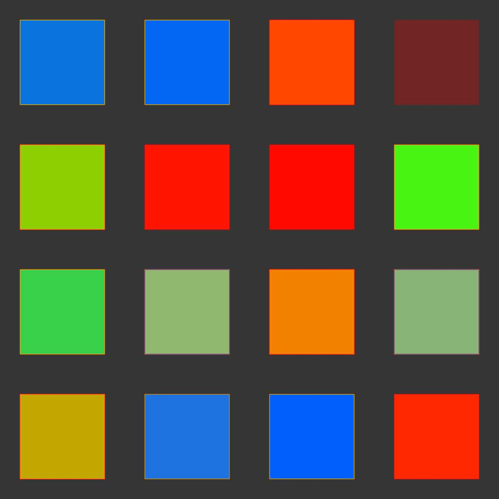

# 扩散颜色

<table>
<tr style="border: 0;">
<td width="33.33%" style="border: 0;" valign="top">

{width="200px"}

<b>英寸：</b>滤镜>效果

</td>
<td width="100.00%" style="border: 0;" valign="top">

## 描述

根据提供的&#x200B;**蒙版**&#x200B;图像输入，对&#x200B;**源**&#x200B;图像输入中的颜色应用漫射处理，在使用[Substance 3D Designer](https://www.adobe.com/cn/products/substance3d-designer.html)时创建平滑的颜色渐变。

只有来自与蒙版匹配的像素的颜色会被扩散；其他像素不会参与结果。

</td>
</tr>
</table>

## 输入

|  |  |
|:---|:---|
| <b>源</b> <i>颜色</i> | 要扩散的图像。 |
| <b>蒙版</b> <i>灰度</i> | 扩散蒙版：白色像素在<i>源</i>中取样，并以黑色像素扩散。 图像应该是黑白的。 如果蒙版包含渐变，则截止值为0.5。 |
| <b>强度</b> <i>灰度</i> | 局部定义扩散过程应用的强度。 此地图应该为<i>对比图</i>，才能产生显着的效果。 |

## 参数

|  |  |
|:---|:---|
| <b>迭代</b> <i>0.0 - 64.0</i> | 要执行的迭代数（越高越好，但速度越慢）。 有用的值在[8， 48]范围内。 请注意，如果您不寻找数学正确性，则低值会很合适，甚至更好。 |
| <b>距离</b> <i>0.0 - 1.0</i> | 调整漫射的最大距离。 |
| <b>启用仿色</b> <i>True/False</i> | 控制每个通道的采样方法。 抖动允许以较少的次数收敛，但会引入杂色。 如果没有它，则每个刀路的速度会更快，但需要更多的刀路才能获得平滑的结果，而不会出现带状伪影。 |
| <b>法线图</b> <i>True/False</i> | 在每个步骤添加值的标准化。 |
| <b>使用Alpha作为蒙版</b> <i>True/False</i> | 使用<i>源</i>输入的Alpha 通道作为漫射蒙版，而不是<i>蒙版</i>输入。 |

## 示例

<table style="margin-top: 32px; margin-bottom: 32px">
    <tr style="border: 0">
        <td style="border: 0; background: transparent">
            
        </td>
        <td style="border: 0; background: transparent">
            
        </td>
        <td style="border: 0; background: transparent">
            
        </td>
    </tr>
    <tr style="border: 0">
        <td style="border: 0; background: transparent">
            
        </td>
        <td style="border: 0; background: transparent">
            
        </td>
        <td style="border: 0; background: transparent">
            
        </td>
    </tr>
    <tr style="border: 0">
        <td style="border: 0; background: transparent">
            
        </td>
        <td style="border: 0; background: transparent">
            
        </td>
    </tr>
</table>
