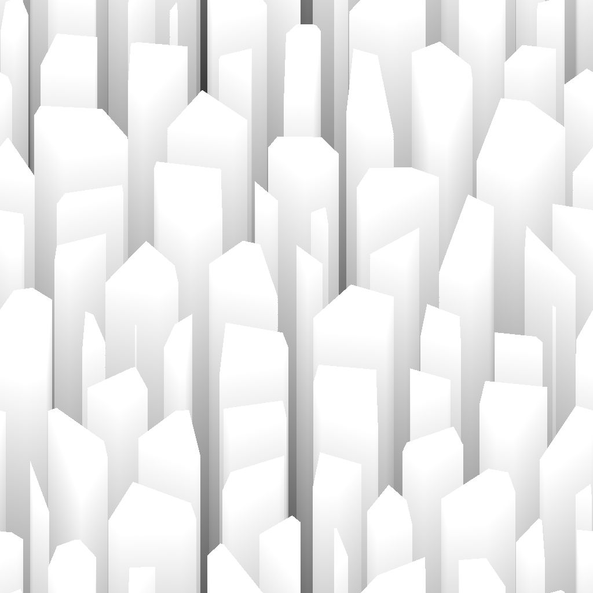
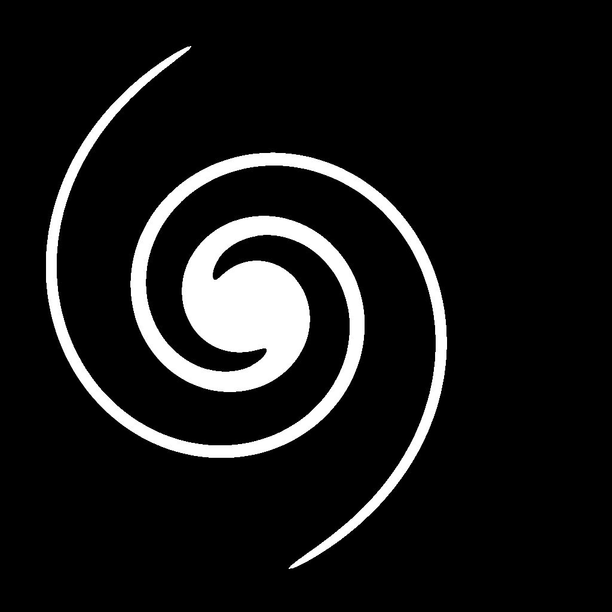

# 方向距离

<table>
<tr style="border: 0;">
<td width="33.33%" style="border: 0;" valign="top">

{width="200px"}

<b>英寸：</b>滤镜>效果

</td>
<td width="100.00%" style="border: 0;" valign="top">

## 描述

沿指定方向从蒙版边界绘制距离渐变。

重叠渐变按反相归一化距离排序，以便绘制到最接近边框的距离。

可以使用距离图沿边界动态调整渐变的距离。

</td>
</tr>
</table>

>[!TIP]
>
> [斜面平滑](../../../../../../compositing-graphs/nodes-reference-for-com/node-library/filters/effects/bevel-smooth/bevel-smooth.md)节点提供类似功能，其中膨胀是全方位执行的。

## 输入

|  |  |
|:---|:---|
| <b>输入</b> <i>灰度</i>主要 | 应从中提取蒙版的图像。   0.5以上的所有值在该蒙版中均为白色。 |
| <b>距离图</b> <i>灰度</i> | “距离图乘数”参数的值大于0时使用的可选输入。   该选项用于调整蒙版边界上的斜角/膨胀距离，较暗的值会产生较短的距离。 |
| <b>角度映射</b> <i>灰度</i> | 一个可选输入，在“角度映射乘数”参数的值大于0时使用。   它用于通过将距离渐变的值添加到方向角（匝数）来调整距离渐变的方向。   使用“角度映射偏移”参数，可以通过指定哪个值为0来重新映射值。 |

## 输出

|  |  |
|:---|:---|
| <b>输出</b> <i>灰度</i> | 根据选定的“输出模式”生成结果图像。 |
| <b>UV</b> <i>颜色</i> | UV沿指定方向从蒙版边界扩展的UV映射。   这可连接到[UV映射器](../../../../../../compositing-graphs/nodes-reference-for-com/node-library/spline-paths-tools/spline-tools/uv-mapper-color/uv-mapper-color.md)节点，以映射使用这些扩展UV的任何其他图像。 |

## 参数

|  |  |
|:---|:---|
| <b>输出模式</b> *整数* | 从蒙版边界绘制距离渐变的方法：<ul data-preserve-html="true"> <li data-preserve-html="true"><b>反向归一化距离：</b>从1到0的渐变，其中0位于“最大距离”处，如果已连接，则乘以“距离图”</li> <li data-preserve-html="true"><b>距离：</b>距蒙版边框的原始距离值的渐变，其中1是输入图像短边的长度</li> </ul> |
| <b>最大距离</b> *Float* | 在归一化图像空间中，距离渐变所行进的距离，其中1是输入图像较短侧的长度。 |
| <b>角度</b> *Float* | 以匝数表示的距离渐变的方向，其中0为水平且向右 — 即(1,0)矢量。 |
| <b>距离图乘数</b> *Float* | 在“最大距离”上调整“距离图”的影响。   注意：当“距离图”输入未连接时，此参数不起作用。 |
| <b>角度映射乘数</b> *Float* | 调整“角度映射”对“角度”的影响。 |
| <b>角度映射偏移</b> *Float* | 通过指定该映射中的哪个值应为0，重新映射“角度映射”中的值。   例如，偏移量0.5表示0.75的值为0.25匝数，0.3的值为–0.2匝数。 |

## 示例

<table>
<tr style="border: 0;">
<td style="border: 0;" valign="top">

<table>
  <tr>
    <td>
      
       <i>之前</i>
    </td>
    <td>
      
       <i>之后</i>
    </td>
  </tr>
</table>

</td>
<td style="border: 0;" valign="top">

<table>
  <tr>
    <td>
      
       <i>之前</i>
    </td>
    <td>
      
       <i>之后</i>
    </td>
  </tr>
</table>

</td>
</tr>
</table>

<table>
<tr style="border: 0;">
<td style="border: 0;" valign="top">

<table>
  <tr>
    <td>
      
       <i>之前</i>
    </td>
    <td>
      
       <i>之后</i>
    </td>
  </tr>
</table>

</td>
<td style="border: 0;" valign="top">

<table>
  <tr>
    <td>
      
       <i>之前</i>
    </td>
    <td>
      
       <i>之后</i>
    </td>
  </tr>
</table>

</td>
</tr>
</table>

<table>
  <tr>
    <td>
      
       <i>之前</i>
    </td>
    <td>
      
       <i>之后</i>
    </td>
  </tr>
</table>
