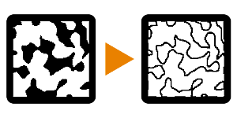

# 边缘检测

<table>
<tr style="border: 0;">
<td width="33.33%" style="border: 0;" valign="top">

{width="128px"}

<b>英寸：</b>滤镜>效果

</td>
<td width="100.00%" style="border: 0;" valign="top">

## 描述

检测黑白图像中的对比度，然后创建黑白蒙版以突出显示对比度。

适用于需要边缘某种蒙版的许多情况。 请记住，它最适合用于高对比度输入；如果需要，在传递到此节点之前调整对比度。

</td>
</tr>
</table>

## 参数

|  |  |
|:---|:---|
| <b>边缘宽度</b> <i>1.0 - 16.0</i> | 边缘周围检测到的区域的宽度。 |
| <b>边缘圆度</b> <i>0.0 - 16.0</i> | 对生成的蒙版进行圆化、模糊和平滑处理。 |
| <b>反转</b> <i>False/True</i> | 反转结果。 |
| <b>容差</b> <i>0.0 - 1.0</i> | 用于显示边的容差阈值因子。 |

## 示例

<table style="margin-top: 32px; margin-bottom: 32px">
    <tr style="border: 0">
        <td style="border: 0; background: transparent">
            
        </td>
    </tr>
</table>
