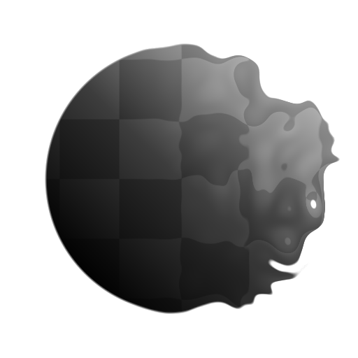

# Non Uniform Directional Warp

<table>
<tr style="border: 0;">
<td width="33.33%" style="border: 0;" valign="top">

<b>英寸：</b>滤镜>效果

</td>
<td width="100.00%" style="border: 0;" valign="top">

## 描述

非均匀方向变形是[定向翘曲](../../../../../../compositing-graphs/nodes-reference-for-com/atomic-nodes/directional-warp/directional-warp.md)的高级版本，它允许图像的输入驱动变形的强度和方向。 它允许进行更多的控制，并且可以创建非常有用且有趣的图像扭曲，与[斜率模糊](../../../../../../compositing-graphs/nodes-reference-for-com/node-library/filters/blurs/slope-blur/slope-blur.md)同样徒劳。

它不同于[多定向翘曲](../../../../../../compositing-graphs/nodes-reference-for-com/node-library/filters/effects/multi-directional-warp/multi-directional-warp.md)，因为它允许通过自定义映射输入控制角度，而多定向翘曲仅允许通过参数控制方向。 这意味着您可以创建高级的尾部效果和曲线效果，否则将无法创建这些效果。

</td>
</tr>
</table>

## 输入

|  |  |
|:---|:---|
| <b>输入</b> <i>灰度输入</i> | 将应用变形的基础图。 |
| <b>强度输入</b> <i>灰度输入</i> | 驱动变形效果强度的强制蒙版图必须是灰度。 |
| <b>变形角度输入</b> <i>灰度输入</i> | 驱动变形效果的角度的强制性蒙版图必须是灰度。 |

## 参数

|  |  |
|:---|:---|
| <b>强度</b> <i>0.0 - 20.0</i> | 设置变形效果的强度，将像素向外推移的距离。 |
| <b>变形角度</b> <i>0.0 - 1.0</i> | 设置应用变形效果的角度或方向。 |
| <b>变形角度输入乘数</b> <i>0.0 - 1.0</i> | 设置变形角度输入图的效果。 将使用“变形角度”输入图从0插入此参数的值。 |
| <b>试用模式</b> <i>最小、最大、平均</i> | 设置描摹的混合方式。 |
| <b>轨迹长度</b> <i>0.0 - 1.0</i> | 设置尾迹的长度。 |
| <b>跟踪渐隐</b> <i>0.0 - 1.0</i> | 设置每个“跟踪”应渐隐的量 |
| <b>轨迹曲线</b> <i>-1.0 - 1.0</i> | 仅当“轨迹”渐隐不是0时才有效。 设置淡化效果的行为方式。 |
