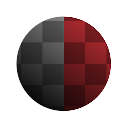

# 形状发光

<table>
<tr style="border: 0;">
<td width="33.33%" style="border: 0;" valign="top">

{width="128px"}

{width="128px"}

<b>英寸：</b>滤镜>效果

</td>
<td width="100.00%" style="border: 0;" valign="top">

## 描述

在输入蒙版（适用于灰度版本）或带有Alpha 通道的形状（适用于彩色版本）周围创建柔和发光。 与[发光](../../../../../../compositing-graphs/nodes-reference-for-com/node-library/filters/effects/glow/glow.md)相比，它的工作方式更类似其他2D图像编辑软件，因为它具有更多控件，是一种更完整的效果。

</td>
</tr>
</table>

## 参数

|  |  |
|:---|:---|
| <b>模式</b> <i>柔和，精确</i> | 在两个精确模式之间切换。 |
| <b>宽度</b> <i>-1.0 - 1.0</i> | 控制发光到多远。 |
| <b>跨页</b> <i>0.0 - 1.0</i> | 模糊效果的截断/阈值使发光在形状附近显示为纯色。 |
| <b>不透明度</b> <i>0.0 - 1.0</i> | 混合发光效果的不透明度。 |
| <b>（阴影）颜色</b> <i>（颜色值）</i> | 应用于发光的色调。 |
| <b>蒙版颜色</b> <i>（颜色值）（仅限灰度版本）</i> | 用于透明度映射输出的纯色。 |
| <b>输入已预乘</b> <i>False/True（仅限颜色版本）</i> | 是否应假设输入为预乘。 |
| <b>预乘输出</b> <i>False/True</i> | 是否应预乘输出。 |

## 示例

<table style="margin-top: 32px; margin-bottom: 32px">
    <tr style="border: 0">
        <td style="border: 0; background: transparent">
            
        </td>
    </tr>
</table>
