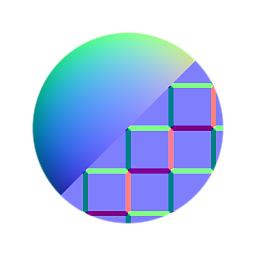

# 正常混合

<table>
<tr style="border: 0;">
<td style="border: 0;" valign="top">

{width="128px"}

## 正常混合

**范围：** *筛选器/法线图*

**中级**

</td>
<td style="border: 0;" valign="top">

## 描述

“正常混合”允许您将两个正常映射与一个可选蒙版混合，同时确保所有值保持正常化。 它与[原子混合节点](../../../../../../compositing-graphs/nodes-reference-for-com/atomic-nodes/blend/blend.md)没有太大区别，但添加了正常映射的内部计算。

普通混合不适用于组合（叠加）正常映射，后者顶部映射将细节添加到底部映射。 为此，请改用[普通合并](../../../../../../compositing-graphs/nodes-reference-for-com/node-library/filters/normal-map/normal-combine/normal-combine.md)。

## 参数

### 输入

* **NormalFG**： *颜色输入*\
  前景/顶部正常映射。
* **NormalBG**： *颜色输入*\
  背景/底部正常映射。
* **蒙版**： *灰度输入*\
  用于遮盖节点效果的遮罩槽。 可以使用“使用蒙版”参数切换。

### 参数

* **不透明度**： *0.0 - 1.0*\
  在前景和背景之间混合不透明度
* **使用蒙版**： *False/True*\
  启用或禁用蒙版图。

## 示例图像

*（.gif格式在示例中引入了仿色，应用程序内结果平滑）*

</td>
</tr>
</table>
