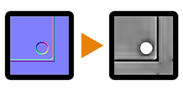

# 正常到Height总部

<table>
<tr style="border: 0;">
<td style="border: 0;" valign="top">

{width="128px"}

## 正常到Height总部

**范围：** *筛选器/法线图*

**中级**

</td>
<td style="border: 0;" valign="top">

## 描述

一个反向转换节点，尝试将切空间正常映射转换回高度映射。 这是较高级的Height；[与Node相同](../../../../../../compositing-graphs/nodes-reference-for-com/node-library/filters/normal-map/normal-to-height/normal-to-height.md)的选项较少，并且使用不同的计算。

当您只有一个正常映射源，但仍要执行将其与高度映射相结合的操作时非常有用。 请记住，这永远无法提供100%的正确结果，因为将Height转换为正常格式时，由于过程的本质而丢失信息。 它永远无法替换正确生成的高图！

## 参数

* **普通格式**： *DirectX，OpenGL*\
  在不同正常映射格式之间切换（反转绿色通道）。
* **浮雕平衡**： *0.0 - 1.0*&#x200B;在低频和高频偏差之间混合。
* **Height强度**： *0.0 - 1.0*&#x200B;高度图的强度或乘数有点像全局不透明度。
* **Height标准化**： *False/True*&#x200B;自动缩放高位图范围以使用全对比度，如[自动色阶](../../../../../../compositing-graphs/nodes-reference-for-com/node-library/filters/adjustments/auto-levels/auto-levels.md)。
* **质量**： *正常、高*&#x200B;在速度或质量之间切换。

## 示例图像

| 

 |
| --- |
|  |

</td>
</tr>
</table>
