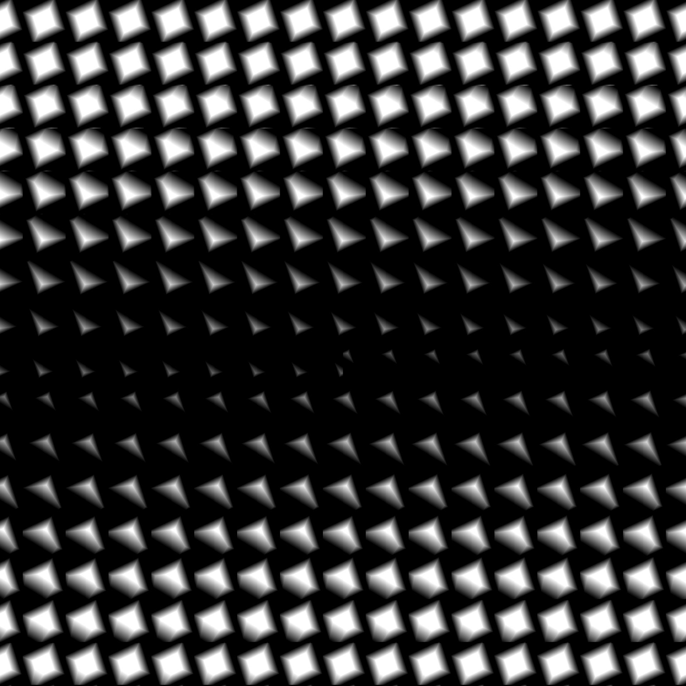

# 3D纹理偏移

<table>
<tr style="border: 0;">
<td width="41.60%" style="border: 0;" valign="top">

<table>
<tr style="border: 0;">
<td style="border: 0;" valign="top">

{width="200px"}

</td>
<td style="border: 0;" valign="top">

{width="200px"}

</td>
</tr>
</table>

**In：** *Filter/Transformation*

**简单**

</td>
<td width="58.30%" style="border: 0;" valign="top">

## 描述

**3D纹理偏移**&#x200B;轴对连接到&#x200B;**输入**&#x200B;的&#x200B;*3D纹理*&#x200B;所描述的对象应用&#x200B;**X**、**Y**&#x200B;和&#x200B;**Z**&#x200B;节点中的&#x200B;*偏移变换*。

</td>
</tr>
</table>

## 参数

### 输入

* **输入** *灰度/颜色*\
  描述3D对象的&#x200B;*3D纹理*。\
  在&#x200B;*单位多维数据集*&#x200B;中通常描述该对象。

### 参数

* **偏移** *Float3*\
  在连接到&#x200B;**输入**&#x200B;的&#x200B;*3D纹理*&#x200B;所描述的对象上应用的&#x200B;*世界空间*&#x200B;偏移量。

## 示例图像

<table>
<tr style="border: 0;">
<td style="border: 0;" valign="top">

{width="256px"}

</td>
<td style="border: 0;" valign="top">

{width="256px"}

</td>
</tr>
</table>
