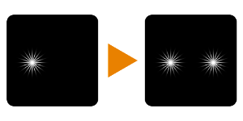

# 仿制(滤镜节点)

<table>
<tr style="border: 0;">
<td style="border: 0;" valign="top">

## 仿制

**在：** *筛选器/变换*

**中级**

</td>
<td style="border: 0;" valign="top">

## 描述

输入图像一次到指定位置。 可以用作原始“仿制图章”工具。

需要注意以下事项，才能获得预期效果：

* 理想情况下，输入图像将具有Alpha 通道（如贴花），因为混合只是一个直线拷贝。
* 蒙版默认为黑色，因此至少需要插入统一的白色灰度值才能看到任何结果。
* “位移”将在图像外部轻松剪切，因此请使用较小的值。

## 参数

### 输入

* **源**： *颜色输入*\
  要仿制的图像。 重要提示：理想情况下，图像将具有Alpha 通道！
* **蒙版**： *灰度输入*\
  用于遮盖节点效果的遮罩槽。 默认为黑色！

### 参数

* **偏移**： *-*\
  移动或平移结果。 正片表示左和上，负片表示右和下。 使用较小的值1.0及更高版本会将其移动到图像之外！
* **模糊蒙版**： *0.0 - 10.0\
  将模糊滤镜应用于蒙版以柔化边缘。*

## 示例图像

| 

 |
| --- |
|  |

</td>
</tr>
</table>
