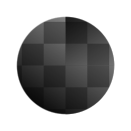

# 镜像（筛选器节点）

<table>
<tr style="border: 0;">
<td width="33.33%" style="border: 0;" valign="top">

{width="128px"}

{width="128px"}

<b>英寸：</b>筛选器>变换

</td>
<td width="100.00%" style="border: 0;" valign="top">

## 描述

将输入图像从选定一侧镜像到选定轴上。 一种非常有用且快速获得对称效果的方法。

</td>
</tr>
</table>

## 参数

|  |  |
|:---|:---|
| <b>模式</b> <i>镜像轴X，镜像轴Y，镜像角</i> | 选择“ ”镜像左右和/或上下视图。 |
| <b>轴X偏移</b> <i>0.0 - 1.0</i> | 仅在选择“轴X”时使用，定义偏移。 |
| <b>轴Y偏移</b> <i>0.0 - 1.0</i> | 仅在选择“轴Y”时使用，定义偏移。 |
| <b>反转轴X</b> <i>False/True</i> | 仅在选择“轴X”时使用，即“反向方向”。 |
| <b>反转轴Y</b> <i>False/True</i> | 仅在选择“轴Y”时使用，即“反向方向”。 |
| <b>角类型</b> <i>左上、右上、左下、右下</i> | 仅当选择“拐角类型”时才使用，定义镜像的拐角。 |

## 示例

<table style="margin-top: 32px; margin-bottom: 32px">
    <tr style="border: 0">
        <td style="border: 0; background: transparent">
            
        </td>
    </tr>
</table>
