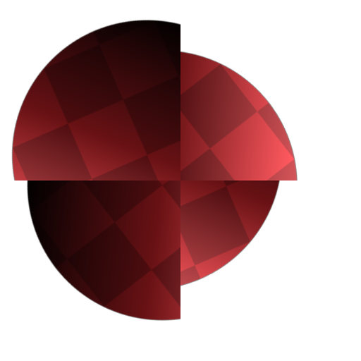

# 非均匀旋转

<table>
<tr style="border: 0;">
<td width="33.33%" style="border: 0;" valign="top">

<table>
<tr style="border: 0;">
<td style="border: 0;" valign="top">

{width="200px"}

</td>
<td style="border: 0;" valign="top">

{width="200px"}

</td>
</tr>
</table>

<b>英寸：</b>筛选器>变换

</td>
<td width="100.00%" style="border: 0;" valign="top">

## 描述

**非均匀旋转**&#x200B;节点使用&#x200B;**旋转贴图**&#x200B;输入旋转&#x200B;**输入**。

图像的值表示&#x200B;*个循环*。 围绕&#x200B;**中心点位置**&#x200B;值或&#x200B;**中心点位置映射**&#x200B;输入指定的位置执行旋转。\
**旋转贴图**&#x200B;输入中的正值导致&#x200B;*顺时针*&#x200B;旋转。

</td>
</tr>
</table>

## 输入

|  |  |
|:---|:---|
| <b>输入</b> <i>灰度/颜色</i> | 应旋转的输入灰度图像。 |
| <b>旋转贴图</b> <i>灰度</i> | 用于控制旋转量的映射，以&#x200B;*旋转次数*&#x200B;为单位。 采样值与&#x200B;**旋转角度乘数**&#x200B;相乘。 负值会导致&#x200B;*逆时针*&#x200B;旋转。 |
| <b>旋转中心点位置映射</b> <i>颜色</i> | 此图像用于指定旋转&#x200B;*透视*&#x200B;的位置。 **X/Y**&#x200B;位置映射到图像的&#x200B;**R/G**&#x200B;通道。 |

## 参数

|  |  |
|:---|:---|
| <b>旋转角度乘数</b> <i>浮动</i> | 调整&#x200B;**旋转贴图**&#x200B;输入的强度。 |
| <b>旋转角度偏移</b> <i>浮动</i> | 应用指定的额外旋转量。 |
| <b>使用中心点位置映射</b> <i>布尔值</i> | 使用&#x200B;*位图输入*&#x200B;指定旋转透视点的位置。 **X/Y**&#x200B;位置映射到&#x200B;**位置映射**&#x200B;输入的&#x200B;**R/G**&#x200B;通道。 |
| <b>中心点位置</b> <i>浮点2</i> | 图像围绕其旋转的枢轴的位置。 |
| <b>背景颜色</b> <i>浮动/浮动4</i> | 背景色，用于在拼贴未设置为&#x200B;**H和V拼贴**&#x200B;的情况下显示图像边界的&#x200B;*外部*。 |
| <b>筛选模式</b> <i>整数</i> | 定义在像素  - *最近的*：之间&#x200B;*插值*&#x200B;时如何处理采样结果：将对完全相同的&#x200B;*相同*&#x200B;值（更快） - *双线性*：对结果应用双线性的滤镜以获得&#x200B;*更平滑*&#x200B;的外观 |

## 示例

<table style="margin-top: 32px; margin-bottom: 32px">
    <tr style="border: 0">
        <td style="border: 0; background: transparent">
            
        </td>
        <td style="border: 0; background: transparent">
            
        </td>
        <td style="border: 0; background: transparent">
            
        </td>
    </tr>
</table>
