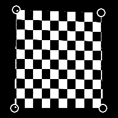

# 四元变换

<table>
<tr style="border: 0;">
<td width="33.33%" style="border: 0;" valign="top">

{width="128px"}

{width="128px"}

<b>英寸：</b>筛选器>变换

</td>
<td width="100.00%" style="border: 0;" valign="top">

## 描述

特殊变换节点，允许通过与四边形角点的交互来变换该形状。 允许以实际操作的方式进行非常具体的变换。

</td>
</tr>
</table>

## 参数

|  |  |
|:---|:---|
| <b>p00</b> | 左上角。 |
| <b>p01</b> | 左下点 |
| <b>p10</b> | 右上角。 |
| <b>p11</b> | 右下角。 |
| <b>剔除</b> <i>仅正面、仅背面、前后对面、后对面</i> | 设置当点相互交叉时形状的剔除/隐藏。 |
| <b>启用拼贴</b> <i>False/True</i> |  |
| <b>背景颜色</b> <i>（灰度值）</i> | 如果关闭拼贴，则为纯背景色。 |
| <b>取样</b> <i>双线性，最接近</i> | 设置取样品质。 |

## 示例

<table style="margin-top: 32px; margin-bottom: 32px">
    <tr style="border: 0">
        <td style="border: 0; background: transparent">
            
        </td>
    </tr>
</table>
