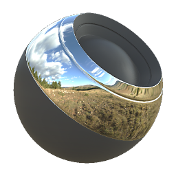

# 材质混合

<table>
<tr style="border: 0;">
<td width="33.33%" style="border: 0;" valign="top">

{width="128px"}

<b>进入：</b>材质过滤器>混合

</td>
<td width="100.00%" style="border: 0;" valign="top">

## 描述

材质混合是多通道、全材质等同于[原子混合节点](../../../../../../compositing-graphs/nodes-reference-for-com/atomic-nodes/blend/blend.md)。 它基于灰度蒙版或可选地基于色彩 ID 蒙版中的一种颜色，在两个完整素材（所有可能的通道）之间混合。

如果要混合两种材质并具有灰度图但没有全色ID烘焙，此节点非常有用。 如果您确实有一个Color ID烘焙并且想要混合两种以上的素材，我们建议您使用[多素材混合](../../../../../../compositing-graphs/nodes-reference-for-com/node-library/material-filters/blending-material/multi-material-blend/multi-material-blend.md)。

</td>
</tr>
</table>

## 输入

|  |  |
|:---|:---|
| <b>颜色ID</b> <i>颜色输入</i> | 可选的烘焙颜色ID映射。 |
| <b>灰度蒙版</b> <i>灰度输入</i> | 用于遮盖节点效果的遮罩槽。 |

## 参数

|  |  |
|:---|:---|
| <b>频道</b> | 当使用“Specular/光泽度”映射而不是“金属/粗糙度”时，可打开和关闭此组中的素材通道。 |
| <b>扩散</b> |  |
| <b>不透明度</b> <i>0.0 - 1.0</i> | 在前景和背景之间混合不透明度 |
| <b>混合模式</b> <i>正常，相加，去除，相乘，相加/次相加，最大，最小，开关</i> |  |
| <b>基色</b> |  |
| <b>不透明度</b> <i>0.0 - 1.0</i> | 在前景和背景之间混合不透明度 |
| <b>混合模式</b> <i>正常，相加，去除，相乘，相加/次相加，最大，最小，开关</i> |  |
| <b>正常</b> |  |
| <b>不透明度</b> <i>0.0 - 1.0</i> | 在前景和背景之间混合不透明度 |
| <b>Specular</b> |  |
| <b>不透明度</b> <i>0.0 - 1.0</i> | 在前景和背景之间混合不透明度 |
| <b>混合模式</b> <i>正常，相加，去除，相乘，相加/次相加，最大，最小，开关</i> |  |
| <b>具发射性</b> |  |
| <b>不透明度</b> <i>0.0 - 1.0</i> | 在前景和背景之间混合不透明度 |
| <b>混合模式</b> <i>正常，相加，去除，相乘，相加/次相加，最大，最小，开关</i> |  |
| <b>光泽度</b> |  |
| <b>不透明度</b> <i>0.0 - 1.0</i> | 在前景和背景之间混合不透明度 |
| <b>混合模式</b> <i>正常，相加，去除，相乘，相加/次相加，最大，最小，开关</i> |  |
| <b>粗糙度</b> |  |
| <b>不透明度</b> <i>0.0 - 1.0</i> | 在前景和背景之间混合不透明度 |
| <b>混合模式</b> <i>正常，相加，去除，相乘，相加/次相加，最大，最小，开关</i> |  |
| <b>金属质感</b> |  |
| <b>不透明度</b> <i>0.0 - 1.0</i> | 在前景和背景之间混合不透明度 |
| <b>混合模式</b> <i>正常，相加，去除，相乘，相加/次相加，最大，最小，开关</i> |  |
| <b>Specular level</b> |  |
| <b>不透明度</b> <i>0.0 - 1.0</i> | 在前景和背景之间混合不透明度 |
| <b>混合模式</b> <i>正常，相加，去除，相乘，相加/次相加，最大，最小，开关</i> |  |
| <b>环境遮蔽</b> |  |
| <b>不透明度</b> <i>0.0 - 1.0</i> | 在前景和背景之间混合不透明度 |
| <b>混合模式</b> <i>正常，相加，去除，相乘，相加/次相加，最大，最小，开关</i> |  |
| <b>Height</b> |  |
| <b>不透明度</b> <i>0.0 - 1.0</i> | 在前景和背景之间混合不透明度 |
| <b>混合模式</b> <i>正常，相加，去除，相乘，相加/次相加，最大，最小，开关</i> |  |
| <b>不透明度</b> |  |
| <b>不透明度</b> <i>0.0 - 1.0</i> | 在前景和背景之间混合不透明度 |
| <b>混合模式</b> <i>正常，相加，去除，相乘，相加/次相加，最大，最小，开关</i> |  |
| <b>色彩 ID 蒙版</b> <i>False/True</i> | 使用色彩 ID 蒙版而非灰度蒙版。 请记住，这只适用于一种颜色！ |
| <b>颜色</b> <i>（颜色值）</i> | 选取哪种颜色并将其转换为白色。 |
| <b>模糊</b> <i>0.01 - 1.0</i> | 您选取的颜色混合到其邻近区域的程度。 |
| <b>填充</b> <i>0.0 - 1.0</i> | 选择颜色的过渡对比度。 |
