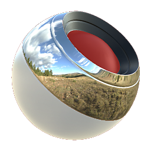

# 多材质混合

<table>
<tr style="border: 0;">
<td style="border: 0;" valign="top">

{width="128px"}

## 多材质混合

**范围：** *材质过滤器/混合*

**中级**

</td>
<td style="border: 0;" valign="top">

## 描述

此节点根据材料ID/颜色Id 图合并多个材料，一个可以从网格中烘焙。 无论您在“声道”组中启用哪种声道，它最多需要16种不同的完整材料。

在对全部属性添加纹理时，节点非常有用，因为它允许对材料进行完全参数化，同时仍动态组合所有属性。 非常适合具有适当ID烘焙的从简单到复杂的道具的纹理化，甚至适合创建完全符合团队标准的完全流水线“模板”Substance。

请记住，使用此材料时，“插槽1”始终是默认材料，并且在任何不显示其他材料的位置都会出现。 这就是您无法为它设置颜色的原因。 如果您想安全地播放此音频，例如可以插入设置为粗黑的[基础材质](../../../../../../compositing-graphs/nodes-reference-for-com/node-library/material-filters/pbr-utilities/base-material/base-material.md)。

## 参数

### 输入

* **1-16个全材料插槽**&#x200B;插槽数量由&#x200B;**材料**&#x200B;下拉菜单确定。
* **颜色ID**： *颜色输入*\
  烘焙的颜色Id 图。

### 参数

* **材料**：*2、3、4、5、6、7、8、9、10、11、12、13、14、15、16*&#x200B;设置要混合的不同材料的最大数量。
* **频道**\
  在此组中打开和关闭素材通道，例如，在使用“Specular/光泽度”映射而非“金属/粗糙度”时。
* **材料2-16**&#x200B;启用每个材料后都会显示一个组。
  * **颜色**： *（颜色值）*要从与此材料槽匹配的Id 图中选取的颜色。
  * **模糊**： *0.01 - 1.0*&#x200B;溢流到邻近颜色。
  * **填充**： *0.0 - 1.0*&#x200B;过渡硬度：蒙版对比度。

## 示例图像

|  |
| --- |
| 没有附加到此页面的图像。 |

</td>
</tr>
</table>
