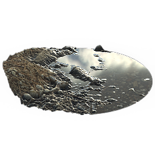

# 水位

<table>
<tr style="border: 0;">
<td width="33.33%" style="border: 0;" valign="top">

{width="128px"}

<b>进入：</b>材质过滤器>效果

</td>
<td width="100.00%" style="border: 0;" valign="top">

## 描述

将水位添加到完整材料输入的一体式效果。 输入材料必须拥有优质、高质量的Heightmap效果才能发挥作用。 结果是PBR正确的。

</td>
</tr>
</table>

## 输入

|  |  |
|:---|:---|
| <b>蒙版</b> <i>灰度输入</i> | 用于遮盖节点效果的遮罩槽。 |

## 参数

|  |  |
|:---|:---|
| <b>频道</b> | 在此组中打开和关闭素材通道，例如，在使用“Specular/光泽度”映射而非“金属/粗糙度”时。 |
| <b>水位</b> <i>0.0 - 1.0</i> | 主控水位上升或下降。 |
| <b>水黑度</b> <i>0.0 - 1.0</i> | 设置水的常规“透明度”。 |
| <b>边缘湿度</b> <i>0.0 - 1.0</i> | 确定水边应该具有多少湿的外观。 |
| <b>边缘湿度距离</b> <i>0.0 - 1.0</i> | 设置潮湿边缘可以到达的距离。 |
| <b>深度模糊量</b> <i>0.0 - 1.0</i> | 根据水面以下深度设置模糊量。 修改模糊半径。 |
| <b>深度模糊不透明度</b> <i>0.0 - 1.0</i> | 确定混合的深度模糊量，可用于降低模糊效果。 |
| <b>污泥颜色</b> <i>（颜色值）</i> | 设置污泥效果的颜色。 |
| <b>污泥深度</b> <i>0.0 - 1.0</i> | 设置污泥开始出现的深度（相对于水位）。 |
| <b>污泥不透明度</b> <i>0.0 - 1.0</i> | 设置污泥效果的全局不透明度。 |
| <b>Frost</b> <i>0.0 - 1.0</i> | 设置霜的量。 开始从外边缘出现并向内移动。 |
| <b>霜冻强度</b> <i>0.0 - 1.0</i> | 设置霜的强度，控制效果的“不透明度”。 |
| <b>霜冻裂缝</b> <i>0.0 - 1.0</i> | 设置从冻结到液体过渡中的裂缝量。 |
| <b>Frost标准格式</b> <i>DirectX/OpenGL</i> | 切换Frost Normalmap效果绿色通道。 |
