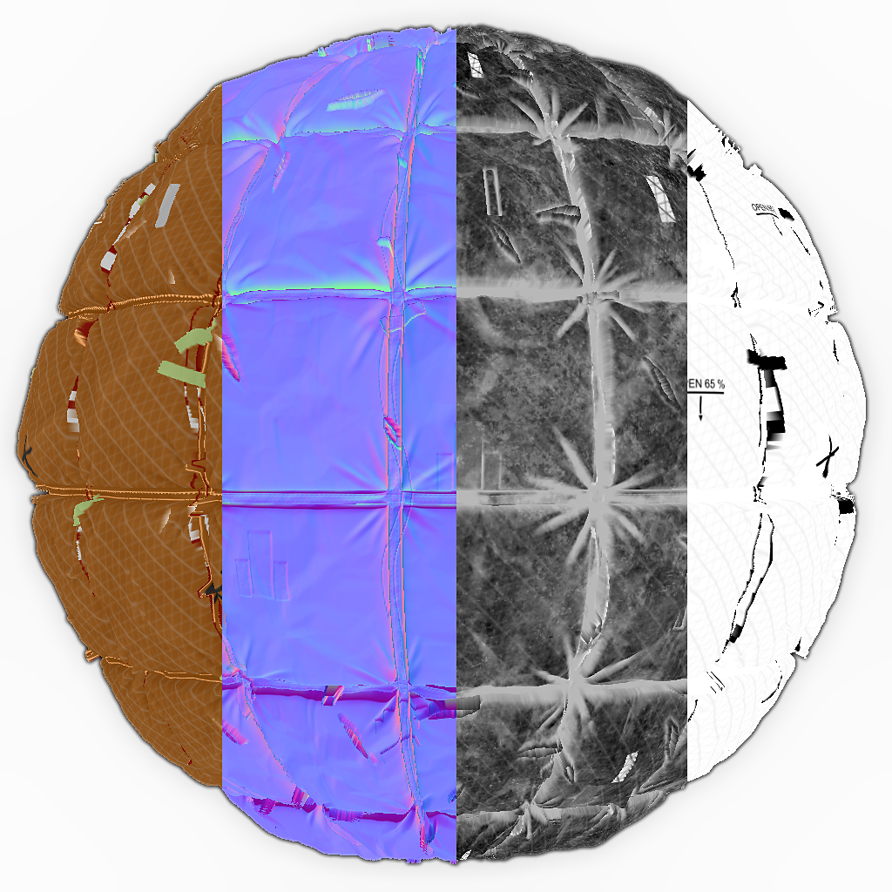

# PBR 渲染映射

<table>
<tr style="border: 0;">
<td width="33.33%" style="border: 0;" valign="top">

<b>进入：</b>材质过滤器> PBR实用工具

</td>
<td width="100.00%" style="border: 0;" valign="top">

## 描述

这是[PBR 渲染节点](../../../../../../compositing-graphs/nodes-reference-for-com/node-library/material-filters/pbr-utilities/pbr-render/pbr-render.md)的扩展节点，它允许您将一个单独的纹理映射到上一个[PBR 渲染](../../../../../../compositing-graphs/nodes-reference-for-com/node-library/material-filters/pbr-utilities/pbr-render/pbr-render.md)的形状上。 其主要目标是让您将[PBR 渲染](../../../../../../compositing-graphs/nodes-reference-for-com/node-library/material-filters/pbr-utilities/pbr-render/pbr-render.md)中的每个单独通道重新映射到形状上，以创建复合映射通道故障，如下例所示。 您可以使用“PBR 渲染映射”节点作为组件，自由创建自己的合成方法和蒙版。

彩色和灰度版本适用于两种类型的数据：对漫射图使用颜色，对粗糙度、金属和其他灰度图使用灰度。

</td>
</tr>
</table>

## 输入

|  |  |
|:---|:---|
| <b>纹理</b> <i>彩色/灰度输入</i> | 映射到形状上的纹理。 |
| <b>UV</b> <i>颜色输入</i> | 从[PBR 渲染节点](../../../../../../compositing-graphs/nodes-reference-for-com/node-library/material-filters/pbr-utilities/pbr-render/pbr-render.md)输入强制UV数据 |

## 参数

|  |  |
|:---|:---|
| <b>背景颜色</b> <i>（颜色值）</i> | 设置纯色值以在背景中使用。 |

## 示例

示例是将[线性渐变](../../../../../../compositing-graphs/nodes-reference-for-com/node-library/texture-generators/patterns/gradient-linear-1/gradient-linear-1.md)上的[直方图选择](../../../../../../compositing-graphs/nodes-reference-for-com/node-library/filters/adjustments/histogram-select/histogram-select.md)用作蒙版的4个不同PBR 渲染映射节点的合成。

<table style="margin-top: 32px; margin-bottom: 32px">
    <tr style="border: 0">
        <td style="border: 0; background: transparent">
            
        </td>
        <td style="border: 0; background: transparent">
            
        </td>
    </tr>
</table>
