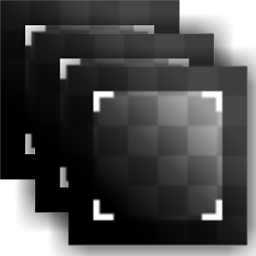

# 多裁剪

<table>
<tr style="border: 0;">
<td style="border: 0;" valign="top">

{width="128px"}

{width="128px"}

## 多裁剪（灰度）

**在：** *材质筛选器/扫描处理*

**中级**

</td>
<td style="border: 0;" valign="top">

## 描述

这是Crop的多通道版本。 它从图像中裁剪出一个区域，主要用于多角度照片，然后与[多角度到反照率](../../../../../../compositing-graphs/nodes-reference-for-com/node-library/material-filters/scan-processing/multi-angle-to-albedo/multi-angle-to-albedo.md)或[多角度到法线](../../../../../../compositing-graphs/nodes-reference-for-com/node-library/material-filters/scan-processing/multi-angle-to-normal/multi-angle-to-normal.md)组合。

>[!NOTE]
>
> 有关详细信息，请参阅原始的[裁剪](../../../../../../compositing-graphs/nodes-reference-for-com/node-library/material-filters/scan-processing/crop/crop.md)。

## 参数

### 参数

* **输入计数**： *1 - 8*&#x200B;设置并行处理的输入数。
* **输入大小**： *0 - 8192*&#x200B;输入图像的分辨率和比例。 对于非方形图像非常重要。
* **背景**： *（颜色值） /（灰度值）*未被“裁剪”覆盖的区域的背景统一值。
* **变换**： *（转换矩阵）*\
  旋转和缩放结果。 可以通过与画布直接交互来修改描摹结果。
* **偏移**： *0.0 - 1.0*\
  移动或转换结果。 可以通过与画布直接交互来修改描摹结果。
* **正常（仅适用于颜色版本）**： *False/True*&#x200B;是否应将输入视为正常映射。

## 示例图像

|  |
| --- |
| 没有附加到此页面的图像。 |

</td>
</tr>
</table>
