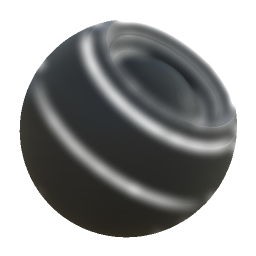

# 边缘模糊

<table>
<tr style="border: 0;">
<td style="border: 0;" valign="top">

{width="128px"}

## 边缘模糊

**英寸：** *基于网格的生成器**/蒙版生成器*

**简单**

</td>
<td style="border: 0;" valign="top">

## 描述

根据已烘焙贴图和用户设置生成黑白蒙版。 类似于[Painter](https://support.allegorithmic.com/documentation/display/SPDOC/Substance+Painter)中的[智能蒙版](https://support.allegorithmic.com/documentation/display/SPDOC/Smart+Materials+and+Masks)。

此蒙版根据烘焙曲率图突出显示边缘。 它是更简单的蒙版生成器之一。

## 参数

### 输入

* **曲率**： *灰度输入*\
  效果的基础所在已烘焙贴图。
* **蒙版（可选）**： *灰度输入*\
  用于遮盖节点效果的遮罩槽。

### 参数

* **级别**： *0.0 - 1.0*\
  设置边加亮量。
* **对比度**： *0.0 - 1.0*\
  调整结果的对比度。
* **模糊半径**： *0.0 - 8.0*&#x200B;设置突出显示边缘的模糊量。

## 示例图像

</td>
</tr>
</table>
