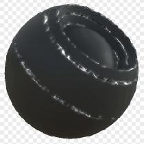

# 边凹槽

<table>
<tr style="border: 0;">
<td width="33.33%" style="border: 0;" valign="top">

{width="128px"}

<b>在</b>中基于网格的生成器>蒙版生成器

</td>
<td width="100.00%" style="border: 0;" valign="top">

## 描述

根据已烘焙贴图和用户设置生成黑白蒙版。 类似于[Painter](https://support.allegorithmic.com/documentation/display/SPDOC/Substance+Painter)中的[智能蒙版](https://support.allegorithmic.com/documentation/display/SPDOC/Smart+Materials+and+Masks)。

此蒙版表示用于凸起的边缘的简单蒙版，被高频噪点分解。 有关更多选项，请参阅[边缘Dirt](../../../../../../compositing-graphs/nodes-reference-for-com/node-library/mesh-based-generators/mask-generators/edge-dirt/edge-dirt.md)或[边缘损坏](../../../../../../compositing-graphs/nodes-reference-for-com/node-library/mesh-based-generators/mask-generators/edge-damages/edge-damages.md)。

</td>
</tr>
</table>

## 输入

|  |  |
|:---|:---|
| <b>曲率</b> <i>灰度输入</i> | 用于加亮边的已烘焙贴图。 必填！ |
| <b>蒙版（可选）</b> <i>灰度输入</i> | 用于遮盖节点效果的遮罩槽。 |

## 参数

|  |  |
|:---|:---|
| <b>级别</b> <i>0.0 - 1.0</i> | 设置“边凹槽”效果的级别。 |
| <b>对比度</b> <i>0.0 - 1.0</i> | 调整结果的对比度。 |

## 示例

<table style="margin-top: 32px; margin-bottom: 32px">
    <tr style="border: 0">
        <td style="border: 0; background: transparent">
            
        </td>
    </tr>
</table>
