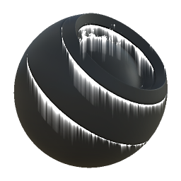

# 泄露

<table>
<tr style="border: 0;">
<td width="33.33%" style="border: 0;" valign="top">

{width="128px"}

<b>在</b>中基于网格的生成器>蒙版生成器

</td>
<td width="100.00%" style="border: 0;" valign="top">

## 描述

根据已烘焙贴图和用户设置生成黑白蒙版。 类似于[Painter](https://support.allegorithmic.com/documentation/display/SPDOC/Substance+Painter)中的[智能蒙版](https://support.allegorithmic.com/documentation/display/SPDOC/Smart+Materials+and+Masks)。

此节点表示从尖锐边缘泄露出的Dirt和尘埃条纹。 当使用烘焙位置生成条纹时，条纹始终向下运行。

确保尝试更改变化蒙版：因为它驱动着条纹的放置，所以它可能比其他蒙版生成器的影响要大得多。

</td>
</tr>
</table>

## 输入

|  |  |
|:---|:---|
| <b>位置</b> <i>灰度输入</i> | 烘焙位置图，用于条纹方向。 必填！ |
| <b>曲率</b> <i>灰度输入</i> | 用于条纹放置的已烘焙贴图。 必填！ |
| <b>环境遮蔽</b> <i>灰度输入</i> | 用于内部效果和蒙版的已烘焙贴图。 建议使用，但您可以使用纯白色。 |
| <b>正常世界空间</b> <i>颜色输入</i> | 世界空间Normalmap，用于条纹方向。 必填！ |
| <b>变体蒙版</b> <i>灰度输入</i> | 可选的变化蒙版，可通过将覆盖设置为True来启用。 |
| <b>蒙版（可选）</b> <i>灰度输入</i> | 用于遮盖节点效果的遮罩槽。 |

## 参数

|  |  |
|:---|:---|
| <b>级别</b> <i>0.0 - 1.0</i> | 结果的总级别。 逐渐显示效果，同时影响长度。 应该设置得相当高，才能长滴水滴。 |
| <b>对比度</b> <i>0.0 - 1.0</i> | 调整结果的对比度。 |
| <b>变体</b> <i>0.0 - 1.0</i> | 设置用于遮蔽条痕的大规模变化量。 将此值设置为0可产生完全一致的条纹，因此应避免这样做。 |
| <b>长度</b> <i>0.0 - 8.0</i> | 条痕的长度。 在较小的范围内将此值设置得太高将导致出现明显的步进。 同时尝试使用色阶。 |
| <b>遮盖</b> <i>X、Y、Z、无</i> | 设置AO应影响的方向。 |
| <b>覆盖变体蒙版</b> <i>False/True</i> | 允许用自定义输入插槽覆盖变化蒙版。 使用稀疏或较稠的蒙版可能非常有趣，是控制滴落的良好方法。 |

## 示例

<table style="margin-top: 32px; margin-bottom: 32px">
    <tr style="border: 0">
        <td style="border: 0; background: transparent">
            
        </td>
    </tr>
</table>
