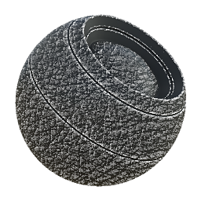

# 皮革磨损

<table>
<tr style="border: 0;">
<td width="33.33%" style="border: 0;" valign="top">

{width="128px"}

<b>在</b>中基于网格的生成器>蒙版生成器

</td>
<td width="100.00%" style="border: 0;" valign="top">

## 描述

根据已烘焙贴图和用户设置生成黑白蒙版。 类似于[Painter](https://support.allegorithmic.com/documentation/display/SPDOC/Substance+Painter)中的[智能蒙版](https://support.allegorithmic.com/documentation/display/SPDOC/Smart+Materials+and+Masks)。

此蒙版呈现皮革图案的磨损效果，根据弯曲在边缘产生更多的磨损。 其功能与[玻璃纤维Edge Wear](../../../../../../compositing-graphs/nodes-reference-for-com/node-library/mesh-based-generators/mask-generators/fiber-glass-edge-wear/fiber-glass-edge-wear.md)相似，参数基本相同。

</td>
</tr>
</table>

## 输入

|  |  |
|:---|:---|
| <b>曲率</b> <i>灰度输入</i> | 用于边放置的已烘焙贴图。 必填！ |
| <b>环境遮蔽</b> <i>灰度输入</i> | 使用的已烘焙贴图遮蔽了某些区域。 推荐，但不是必需的。 |
| <b>污渍输入</b> <i>灰度输入</i> | 可选污渍映射输入插槽，可通过“使用自定义污渍”参数切换。 |
| <b>蒙版（可选）</b> <i>灰度输入</i> | 用于遮盖节点效果的遮罩槽。 |

## 参数

|  |  |
|:---|:---|
| <b>磨损级别</b> <i>0.0 - 1.0</i> | 设置全局磨损级别，逐渐显示。 |
| <b>佩戴对比度</b> <i>0.0 - 1.0</i> | 设置效果的对比度。 |
| <b>污渍量</b> <i>0.0 - 1.0</i> | 设置要在边缘之间混合的污渍量（默认皮革图案）。 |
| <b>Ambient occlusion蒙版</b> <i>0.0 - 1.0</i> | 设置AO遮蔽磨损效果的程度。 |
| <b>弯曲粗细</b> <i>0.0 - 1.0</i> | 设置弯曲的边缘对最终结果的影响程度。 即使设置为0，您仍需要曲率图。 |
| <b>使用自定义污渍</b> <i>False/True</i> | 允许覆盖内置的默认皮革图案。 请改用自定义输入槽。 |

## 示例

<table style="margin-top: 32px; margin-bottom: 32px">
    <tr style="border: 0">
        <td style="border: 0; background: transparent">
            
        </td>
    </tr>
</table>
