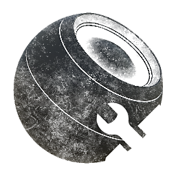

# 蒙版生成器

<table>
<tr style="border: 0;">
<td width="33.33%" style="border: 0;" valign="top">

{width="128px"}

<b>在</b>中基于网格的生成器>蒙版生成器

</td>
<td width="100.00%" style="border: 0;" valign="top">

## 描述

根据已烘焙贴图和用户设置生成黑白蒙版。 这几乎是Painter蒙版生成器的Designer版本。

它是一种复杂的工具，旨在作为基于已烘焙贴图、用户参数和污渍模式及地图的全方位蒙版生成器。 它主要是作为一个非常先进的、完全控制的节点，用于混合折痕Dirt和边缘磨损。 此节点功能强大，足以模拟其他所有蒙版生成器。

没有明确要求的烘焙，但您提供的越多，此节点所能执行的操作就越多。

</td>
</tr>
</table>

## 输入

|  |  |
|:---|:---|
| <b>环境遮蔽</b> <i>灰度输入</i> |  |
| <b>曲率</b> <i>灰度输入</i> |  |
| <b>世界空间法线</b> <i>颜色输入</i> |  |
| <b>污渍输入</b> <i>灰度输入</i> |  |
| <b>污渍输入2</b> <i>灰度输入</i> |  |
| <b>输入散点</b> <i>灰度输入</i> | 自定义散点图章，使用散点参数时需要使用该图章。 |
| <b>蒙版（可选）</b> <i>灰度输入</i> | 用于遮盖节点效果的遮罩槽。 |
| <b>位置</b> <i>颜色输入</i> | 用于三平面和上下效果。 |

## 参数

|  |  |
|:---|:---|
| <b>级别</b> <i>0.0 - 1.0</i> | 设置效果的总级别，逐渐显示出来。 |
| <b>对比度</b> <i>0.0 - 1.0</i> | 调整结果的对比度。 |
| <b>反转</b> <i>False/True</i> | 反转结果。 有助于实现与所构建蒙版相反的效果。 |
| <b>使用三平面</b> <i>False/True</i> | 启用三平面投影，避免任何具有污渍映射的接缝。 |
| <b>三平面混合对比度</b> <i>0.0 - 1.0</i> | 设置三平面混合的对比度。 |
| <b>污渍</b> <i>0.0 - 1.0</i> | 设置要全局混合的污渍量。 |
| <b>污渍</b> |  |
| <b>缩放</b> <i>0 - 10</i> | 设置全局污渍的比例。 |
| <b>使用自定义污渍</b> <i>False/True</i> | 启用自定义污渍输入。 |
| <b>辅助自定义污渍</b> <i>0.0 - 1.0</i> | 启用第二个自定义污渍输入。 |
| <b>反转</b> <i>False/True</i> | 反转污渍映射。 |
| <b>AO</b> <i>-1.0 - 1.0</i> | 设置此效果应在被遮盖的AO区域中出现的程度。 可使用以下组进行调整。 |
| <b>AO</b> |  |
| <b>范围</b> <i>0.0 - 1.0</i> | 设置Dirt外观的阈值或范围。 |
| <b>对比度</b> <i>0.0 - 1.0</i> | 调整AO效果的对比度。 |
| <b>杂色</b> <i>0.0 - 1.0</i> | 设置要混合到AO效果中的噪声/污渍量。 |
| <b>噪声比例</b> <i>0 - 10</i> | 设置AO噪声/污渍的比例。 |
| <b>噪声类型</b> <i>斑点、云、潮湿、白噪声</i> | 在4种不同类型的AO噪声之间切换。 |
| <b>反转</b> <i>False/True</i> | 反转对AO地图的解释：噪声将出现在明亮的AO区域，而不是暗区。 |
| <b>曲率</b> <i>0.0 - 1.0</i> | 设置应该在弯曲边上显示的效果量；可以是凸的，也可以是凹的。 用下面的组稍作调整。 |
| <b>曲率</b> |  |
| <b>凸范围</b> <i>-1.0 - 1.0</i> | 设置凸形（明亮）弯曲边缘要呈现的效果。 |
| <b>凸对比度</b> <i>0.0 - 1.0</i> | 设置凸形效果的对比度。 |
| <b>凸反转</b> <i>False/True</i> | 反转凸边的解释。 |
| <b>凹形范围</b> <i>-1.0 - 1.0</i> | 设置要在凹形（深色）弯曲边上显示的效果量。 |
| <b>凹形对比度</b> <i>0.0 - 1.0</i> | 设置凹形范围的对比度。 |
| <b>凹反转</b> <i>False/True</i> | 反转凹边的解释。 |
| <b>Smoothness</b> <i>0.0 - 16.0</i> | 应用于弯曲边缘的模糊和平滑量。 |
| <b>水平提升</b> <i>0.0 - 1.0</i> | 如果效果不够明显，请另外增加助推器。 |
| <b>杂色</b> <i>0.0 - 1.0</i> | 设置噪声/污渍对弯曲效果的影响。 |
| <b>噪声比例</b> <i>0 - 10</i> | 设置噪声的比例。 |
| <b>噪声类型</b> <i>斑点、云、潮湿、白噪声</i> | 从4种不同的噪声类型中进行选择。 |
| <b>上/下渐变</b> <i>-1.0 - 1.0</i> | 基于位置图使用从上到下的渐变在蒙版上混合。 正值使图像变得更亮，负值会掩盖现有效果。 |
| <b>渐变</b> |  |
| <b>范围</b> <i>0.0 - 1.0</i> | 设置渐变的位置。 |
| <b>对比度</b> <i>0.0 - 1.0</i> | 调整渐变的对比度。 |
| <b>反转</b> <i>False/True</i> | 反转渐变。 有效地交换底部和顶部。 |
| <b>世界空间正常</b> <i>0.0 - 1.0</i> | 类似于“Top/Down Gradient”（上/下渐变），但是使用位置地图和六个方向，类似于假光照。 正值调亮，负值调暗。 |
| <b>世界空间正常</b> |  |
| <b>顶部强度</b> <i>-1.0 - 1.0</i> |  |
| <b>底部强度</b> <i>-1.0 - 1.0</i> |  |
| <b>前部强度</b> <i>-1.0 - 1.0</i> |  |
| <b>背部强度</b> <i>-1.0 - 1.0</i> |  |
| <b>右侧强度</b> <i>-1.0 - 1.0</i> |  |
| <b>左侧强度</b> <i>-1.0 - 1.0</i> |  |
| <b>Scratches</b> <i>-1.0 - 1.0</i> | 混合划痕到白色区域。 |
| <b>Scratches</b> |  |
| <b>金额</b> <i>0 - 4096</i> | 设置划痕的总量。 |
| <b>缩放</b> <i>0.0 - 1.0</i> | 设置单个划痕的比例。 |
| <b>散点</b> <i>-1.0 - 1.0</i> | 在白色区域中散点自定义图章。 |
| <b>散点</b> |  |
| <b>缩放</b> <i>0 - 50</i> | 效果的总大小。 |
| <b>密度</b> <i>0.0 - 1.0</i> | 散布密度控制，应显示的数字。 |
| <b>大小</b> <i>0.0 - 4.0</i> | 散布图章的大小。 |
| <b>大小变化</b> <i>0.0 - 1.0</i> | 图章大小的变化。 |
| <b>不透明度变化</b> <i>0.0 - 1.0</i> | 图章不透明度内的变化。 |
