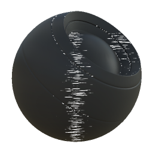

# 表面画笔

<table>
<tr style="border: 0;">
<td width="33.33%" style="border: 0;" valign="top">

{width="128px"}

<b>在</b>中基于网格的生成器>蒙版生成器

</td>
<td width="100.00%" style="border: 0;" valign="top">

## 描述

根据已烘焙贴图和用户设置生成黑白蒙版。 类似于[Painter](https://support.allegorithmic.com/documentation/display/SPDOC/Substance+Painter)中的[智能蒙版](https://support.allegorithmic.com/documentation/display/SPDOC/Smart+Materials+and+Masks)。

此蒙版代表对象表面上金属刷的有趣效果，被对象几何形状和AO遮蔽。

</td>
</tr>
</table>

## 输入

|  |  |
|:---|:---|
| <b>世界空间正常</b> <i>颜色输入</i> |  |
| <b>曲率</b> <i>灰度输入</i> | 用于内部效果和蒙版的已烘焙贴图。 |
| <b>环境遮蔽</b> <i>灰度输入</i> | 用于内部效果和蒙版的已烘焙贴图。 |
| <b>位置</b> <i>灰度输入</i> |  |
| <b>蒙版（可选）</b> <i>灰度输入</i> | 用于遮盖节点效果的遮罩槽。 |

## 参数

|  |  |
|:---|:---|
| <b>级别</b> <i>0.0 - 1.0</i> | 设置全局效果级别，逐渐显示。 |
| <b>对比度</b> <i>0.0 - 1.0</i> | 调整结果的对比度。 |
| <b>Scratches长度</b> <i>0.0 - 8.0</i> | 设置划痕的长度。 较小的值更像点，较高的值则为长条纹。 |
| <b>遮盖轴</b> <i>X、Y、Z、无</i> | 应接收划痕的对象轴。 不会改变划痕的方向。 |
| <b>遮蔽轴强度</b> <i>0.0 - 1.0</i> | 遮蔽效果的强度。 |
| <b>遮蔽</b> <i>0.0 - 1.0</i> | AO关于遮挡划痕的强度。 |
| <b>锐化强度</b> <i>0.0 - 1.0</i> | 设置应用到划痕的后锐化量。 |

## 示例

<table style="margin-top: 32px; margin-bottom: 32px">
    <tr style="border: 0">
        <td style="border: 0; background: transparent">
            
        </td>
    </tr>
</table>
